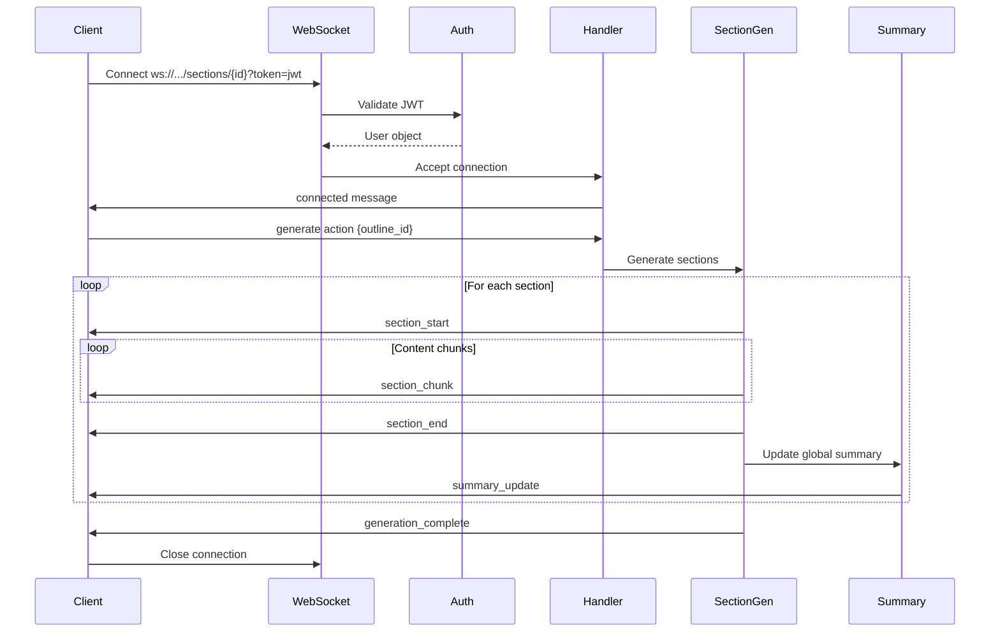
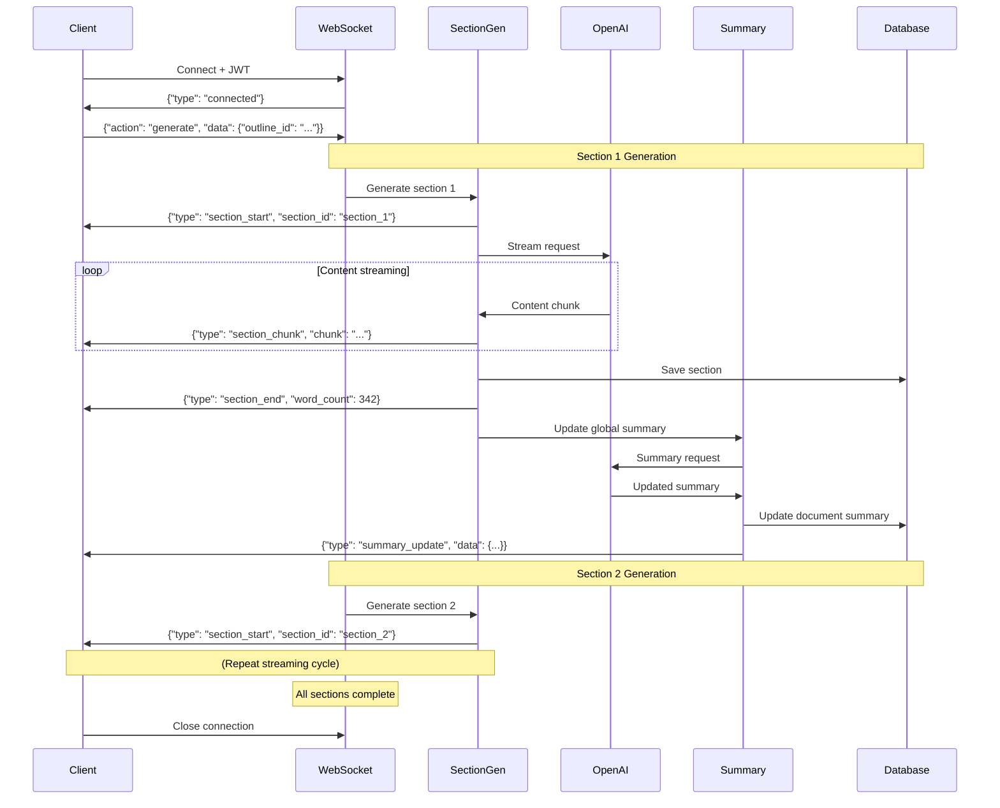

# WebSocket Protocol Documentation

**Endpoint**: `ws://host/api/ws/sections/{document_id}?token=<jwt>`
**Task**: T-06 Section Generation WebSocket
**Status**: Implemented (ST1, ST2, ST3 Complete)
**Version**: 1.0.0

## Overview

The WebSocket API provides real-time document section generation with streaming content delivery. It implements incremental section generation from structured outlines (T-05 Planner Service) with live progress updates and global document summaries.

### Key Features

- **Real-Time Streaming**: Incremental content chunks as they arrive from LLM (50-100ms frequency)
- **Section-by-Section Generation**: Ordered generation following outline hierarchy (H1→H2→H3)
- **Global Summaries**: Incremental document summary updates after each section (T-06 ST3)
- **JWT Authentication**: Secure connection with token-based auth
- **Multi-Tenancy Isolation**: User-specific data access via JWT user_id
- **Error Recovery**: Non-fatal section errors don't stop entire generation
- **Performance**: Handshake ≤150ms, Section generation ≤20s, Summary ≤500ms

## Architecture

The WebSocket service follows **Hexagonal Architecture (Ports and Adapters)** for maintainability:

```
WebSocket /api/ws/sections/{document_id} (FastAPI Router)
  ↓
SectionHandler (Connection Lifecycle)
  ↓
├─ PlannerService (Outline Retrieval)
├─ SectionGenerationService (Domain Logic)
│    ↓
│    ├─ OpenAIStreamingPort → OpenAIStreamingAdapter
│    └─ SectionRepositoryPort → SectionRepositoryAdapter
└─ SummaryService (Global Summary Updates - ST3)
     ↓
     ├─ SummaryPort → SummaryAdapter
     └─ SectionRepositoryPort → SectionRepositoryAdapter
```

**Key Components**:
- **SectionHandler**: Manages WebSocket connection lifecycle and message routing
- **SectionGenerationService**: Orchestrates section content streaming and persistence
- **SummaryService**: Generates incremental document summaries after each section
- **OpenAIStreamingAdapter**: Streams LLM content chunks in real-time
- **ConnectionManager**: Handles concurrent WebSocket connections

See [T-06-ST1-IMPLEMENTATION-SUMMARY.md](../T-06-ST1-IMPLEMENTATION-SUMMARY.md) for detailed architecture decisions.

## API Specification

### Endpoint

```
ws://host/api/ws/sections/{document_id}?token=<jwt_token>
```

**Parameters**:

| Parameter | Location | Type | Required | Description |
|-----------|----------|------|----------|-------------|
| `document_id` | Path | string (UUID) | Yes | Document ID for this session |
| `token` | Query | string (JWT) | Yes | JWT authentication token |

### Authentication

**Required**: JWT token passed as query parameter

```javascript
const ws = new WebSocket('ws://localhost:8000/api/ws/sections/doc-uuid?token=eyJhbGc...');
```

**Authentication Flow**:
1. Client includes JWT token in connection URL
2. Server validates token via `authenticate_websocket()` middleware
3. On success: Connection accepted, `connected` message sent
4. On failure: Connection closed with `WS_1008_POLICY_VIOLATION`

**JWT Requirements**:
- Valid signature (HS256 algorithm)
- Not expired (per configured TTL)
- Contains valid user_id claim

### Connection Lifecycle



## Message Protocol

All messages are JSON objects with a `type` field indicating message category.

### Message Format

```json
{
  "type": "message_type",
  "field1": "value1",
  "field2": "value2",
  "timestamp": 1697558400.123
}
```

**Common Fields**:
- `type` (string): Message type identifier
- `timestamp` (float): Unix epoch timestamp with millisecond precision

### Direction Indicators

- **Server→Client**: Messages sent from server to WebSocket client
- **Client→Server**: Messages sent from client to server

---

## Server→Client Messages

### 1. connected

**Sent**: Immediately after WebSocket connection established and authenticated

**Purpose**: Confirms successful connection and provides session metadata

**Schema**:
```json
{
  "type": "connected",
  "document_id": "550e8400-e29b-41d4-a716-446655440000",
  "user_id": "7c9e6679-7425-40de-944b-e07fc1f90ae7",
  "message": "WebSocket connection established",
  "timestamp": 1697558400.123
}
```

**Fields**:

| Field | Type | Description |
|-------|------|-------------|
| `type` | string | Always `"connected"` |
| `document_id` | string (UUID) | Document ID for this session |
| `user_id` | string (UUID) | Authenticated user ID |
| `message` | string | Human-readable status message |
| `timestamp` | float | Unix epoch timestamp |

**Example**:
```json
{
  "type": "connected",
  "document_id": "550e8400-e29b-41d4-a716-446655440000",
  "user_id": "7c9e6679-7425-40de-944b-e07fc1f90ae7",
  "message": "WebSocket connection established",
  "timestamp": 1697558400.123
}
```

---

### 2. section_start

**Sent**: When generation of a new section begins

**Purpose**: Provides section metadata before streaming content chunks

**Schema**:
```json
{
  "type": "section_start",
  "section_id": "section_1",
  "heading_id": "H1",
  "heading_text": "Introduction to Machine Learning",
  "heading_level": 1,
  "timestamp": 1697558401.456
}
```

**Fields**:

| Field | Type | Description |
|-------|------|-------------|
| `type` | string | Always `"section_start"` |
| `section_id` | string | Unique section identifier (e.g., `section_1`, `section_2`) |
| `heading_id` | string | Heading ID from outline (e.g., `H1`, `H1.1`, `H2.3`) |
| `heading_text` | string | Section heading text |
| `heading_level` | integer | Heading level (1-6) |
| `timestamp` | float | Unix epoch timestamp |

**Example**:
```json
{
  "type": "section_start",
  "section_id": "section_1",
  "heading_id": "H1",
  "heading_text": "Introduction to Machine Learning",
  "heading_level": 1,
  "timestamp": 1697558401.456
}
```

---

### 3. section_chunk

**Sent**: During section content streaming (50-100ms frequency)

**Purpose**: Delivers incremental content chunks as they arrive from LLM

**Schema**:
```json
{
  "type": "section_chunk",
  "section_id": "section_1",
  "chunk": "Machine learning is a subset of artificial intelligence...",
  "chunk_index": 0,
  "timestamp": 1697558401.567
}
```

**Fields**:

| Field | Type | Description |
|-------|------|-------------|
| `type` | string | Always `"section_chunk"` |
| `section_id` | string | Section identifier this chunk belongs to |
| `chunk` | string | Incremental content chunk (markdown text, 50-200 chars typical) |
| `chunk_index` | integer | Sequential chunk index starting from 0 |
| `timestamp` | float | Unix epoch timestamp |

**Example Sequence** (3 chunks for one section):
```json
{
  "type": "section_chunk",
  "section_id": "section_1",
  "chunk": "Machine learning is a subset of artificial intelligence",
  "chunk_index": 0,
  "timestamp": 1697558401.567
}
```
```json
{
  "type": "section_chunk",
  "section_id": "section_1",
  "chunk": " that enables systems to learn from data",
  "chunk_index": 1,
  "timestamp": 1697558401.612
}
```
```json
{
  "type": "section_chunk",
  "section_id": "section_1",
  "chunk": " and improve performance over time.",
  "chunk_index": 2,
  "timestamp": 1697558401.668
}
```

**UI Integration**:
- Append chunks to display buffer in real-time
- Use `chunk_index` to handle out-of-order delivery (rare)
- Chunks are markdown-formatted (bold, lists, code blocks)

---

### 4. section_end

**Sent**: When a section generation completes

**Purpose**: Provides final section metadata, statistics, and complete content

**Schema**:
```json
{
  "type": "section_end",
  "section_id": "section_1",
  "heading_id": "H1",
  "full_content": "Machine learning is a subset of artificial intelligence...",
  "word_count": 342,
  "tokens_used": 487,
  "generation_time_ms": 1850,
  "timestamp": 1697558403.317
}
```

**Fields**:

| Field | Type | Description |
|-------|------|-------------|
| `type` | string | Always `"section_end"` |
| `section_id` | string | Section identifier that completed |
| `heading_id` | string | Heading ID from outline |
| `full_content` | string | Complete section content (all chunks concatenated) |
| `word_count` | integer | Final word count |
| `tokens_used` | integer | Total tokens consumed by LLM |
| `generation_time_ms` | integer | Generation time in milliseconds |
| `timestamp` | float | Unix epoch timestamp |

**Example**:
```json
{
  "type": "section_end",
  "section_id": "section_1",
  "heading_id": "H1",
  "full_content": "Machine learning is a subset of artificial intelligence that enables systems to learn from data and improve performance over time. It has revolutionized many industries...",
  "word_count": 342,
  "tokens_used": 487,
  "generation_time_ms": 1850,
  "timestamp": 1697558403.317
}
```

**Use Cases**:
- Validate chunk concatenation against `full_content`
- Update progress bar using `tokens_used` / estimated total
- Display generation time in UI for transparency

---

### 5. summary_update

**Sent**: After each section completes (T-06 ST3)

**Purpose**: Provides incremental global document summary and progress metrics

**Schema**:
```json
{
  "type": "summary_update",
  "message_id": "f47ac10b-58cc-4372-a567-0e02b2c3d479",
  "timestamp": 1697558403.500,
  "data": {
    "summary": "This document covers machine learning fundamentals...",
    "sections_completed": 1,
    "total_sections": 5,
    "total_words": 342,
    "total_tokens": 487,
    "summary_updated_at": "2025-10-21T14:30:03.500Z"
  }
}
```

**Fields**:

| Field | Type | Description |
|-------|------|-------------|
| `type` | string | Always `"summary_update"` |
| `message_id` | string (UUID) | Unique message identifier |
| `timestamp` | float | Unix epoch timestamp |
| `data` | object | Summary metadata (see below) |

**data Object**:

| Field | Type | Description |
|-------|------|-------------|
| `summary` | string | Current global document summary (≤200 tokens) |
| `sections_completed` | integer | Number of sections completed so far |
| `total_sections` | integer | Total sections in outline |
| `total_words` | integer | Cumulative word count across all completed sections |
| `total_tokens` | integer | Cumulative tokens consumed |
| `summary_updated_at` | string (ISO 8601) | Timestamp when summary was last updated |

**Example**:
```json
{
  "type": "summary_update",
  "message_id": "f47ac10b-58cc-4372-a567-0e02b2c3d479",
  "timestamp": 1697558403.500,
  "data": {
    "summary": "This document covers machine learning fundamentals including supervised and unsupervised learning, neural networks, and practical applications in industry.",
    "sections_completed": 3,
    "total_sections": 7,
    "total_words": 1024,
    "total_tokens": 1450,
    "summary_updated_at": "2025-10-21T14:30:03.500Z"
  }
}
```

**Performance**:
- Summary generation: ≤500ms (p95) via incremental strategy
- Uses `gpt-3.5-turbo` for speed
- Max 200 tokens for concise summaries

**Error Handling**:
- Non-fatal: If summary generation fails, error event sent but generation continues
- Incremental: Each summary update includes previous content + new section

---

### 6. generation_complete

**Sent**: When all sections have been generated successfully

**Purpose**: Final statistics and completion confirmation (currently not implemented in code, but planned)

**Schema**:
```json
{
  "type": "generation_complete",
  "document_id": "550e8400-e29b-41d4-a716-446655440000",
  "total_sections": 7,
  "total_words": 2400,
  "total_tokens": 3450,
  "total_generation_time_ms": 15800,
  "message": "Document generation complete",
  "timestamp": 1697558418.123
}
```

**Fields**:

| Field | Type | Description |
|-------|------|-------------|
| `type` | string | Always `"generation_complete"` |
| `document_id` | string (UUID) | Completed document ID |
| `total_sections` | integer | Total sections generated |
| `total_words` | integer | Total word count across all sections |
| `total_tokens` | integer | Total tokens consumed |
| `total_generation_time_ms` | integer | Total generation time (milliseconds) |
| `message` | string | Completion message |
| `timestamp` | float | Unix epoch timestamp |

**Note**: Implementation planned for future enhancement (currently generation ends without explicit completion message).

---

### 7. error

**Sent**: When an error occurs during connection or generation

**Purpose**: Provides error details and indicates whether connection should close

**Schema**:
```json
{
  "type": "error",
  "error_code": "GENERATION_FAILED",
  "error_message": "Failed to generate section 'Introduction': OpenAI API error",
  "details": {
    "api_error": "rate_limit_exceeded",
    "retry_after": 60
  },
  "section_id": "section_1",
  "fatal": false,
  "timestamp": 1697558405.123
}
```

**Fields**:

| Field | Type | Description |
|-------|------|-------------|
| `type` | string | Always `"error"` |
| `error_code` | string | Error code (see Error Codes section) |
| `error_message` | string | Human-readable error message |
| `details` | object | Optional additional error context |
| `section_id` | string | Optional section ID if error is section-specific |
| `fatal` | boolean | If `true`, connection will close after this message |
| `timestamp` | float | Unix epoch timestamp |

**Common Error Codes**:

| Error Code | Fatal | Description |
|------------|-------|-------------|
| `CONNECTION_ERROR` | Yes | WebSocket connection error |
| `INVALID_MESSAGE` | No | Invalid JSON from client |
| `UNKNOWN_ACTION` | No | Unrecognized client action |
| `INVALID_ACTION` | No | Invalid client action message |
| `MISSING_OUTLINE_ID` | No | Required outline_id not provided |
| `OUTLINE_NOT_FOUND` | Yes | Outline does not exist or access denied |
| `API_KEY_NOT_FOUND` | Yes | No OpenAI API key configured |
| `INVALID_UUID` | No | Invalid UUID format |
| `GENERATION_FAILED` | Yes | Section generation failed |
| `SECTION_GENERATION_FAILED` | No | Single section failed (non-fatal) |
| `SUMMARY_GENERATION_FAILED` | No | Summary update failed (non-fatal) |

**Example (Fatal Error)**:
```json
{
  "type": "error",
  "error_code": "API_KEY_NOT_FOUND",
  "error_message": "OpenAI API key not configured for user",
  "details": null,
  "section_id": null,
  "fatal": true,
  "timestamp": 1697558405.123
}
```

**Example (Non-Fatal Error)**:
```json
{
  "type": "error",
  "error_code": "SECTION_GENERATION_FAILED",
  "error_message": "Failed to generate section 'Background': Connection timeout",
  "details": null,
  "section_id": "section_2",
  "fatal": false,
  "timestamp": 1697558410.456
}
```

**Error Recovery**:
- **Fatal errors**: Connection closes, client should reconnect with corrected parameters
- **Non-fatal errors**: Generation continues to next section, failed section skipped

---

## Client→Server Messages

### generate

**Sent**: By client to start section generation from an outline

**Purpose**: Initiates section generation with outline ID and optional parameters

**Schema**:
```json
{
  "type": "client_action",
  "action": "generate",
  "data": {
    "outline_id": "f47ac10b-58cc-4372-a567-0e02b2c3d479",
    "model": "gpt-4o-mini",
    "temperature": 0.7,
    "max_tokens": 600
  }
}
```

**Fields**:

| Field | Type | Required | Description |
|-------|------|----------|-------------|
| `type` | string | Yes | Always `"client_action"` |
| `action` | string | Yes | Always `"generate"` for section generation |
| `data` | object | Yes | Generation parameters (see below) |

**data Object**:

| Field | Type | Required | Default | Description |
|-------|------|----------|---------|-------------|
| `outline_id` | string (UUID) | Yes | - | Outline ID from T-05 Planner Service |
| `model` | string | No | `"gpt-4o-mini"` | OpenAI model (gpt-4o, gpt-4o-mini, gpt-3.5-turbo) |
| `temperature` | float | No | `0.7` | LLM temperature (0.0-2.0) |
| `max_tokens` | integer | No | `600` | Max tokens per section |

**Example**:
```json
{
  "type": "client_action",
  "action": "generate",
  "data": {
    "outline_id": "f47ac10b-58cc-4372-a567-0e02b2c3d479",
    "model": "gpt-4o-mini",
    "temperature": 0.7,
    "max_tokens": 600
  }
}
```

**Expected Server Response**:
- `section_start` → `section_chunk`* → `section_end` → `summary_update` (repeated for each section)
- `error` (if generation fails)

---

### pause / resume / cancel (Planned)

**Status**: Not yet implemented (placeholder in code)

**Purpose**: Control generation flow (pause, resume, cancel)

**Schema**:
```json
{
  "type": "client_action",
  "action": "pause",
  "section_id": "section_3",
  "reason": "User requested pause"
}
```

**Note**: Currently returns warning log, implementation planned for future release.

---

## WebSocket Close Codes

| Code | Name | Description | Cause |
|------|------|-------------|-------|
| `1000` | `NORMAL_CLOSURE` | Normal connection close | Client or server closed gracefully |
| `1008` | `POLICY_VIOLATION` | Authentication failed | Invalid/missing JWT token |
| `1011` | `INTERNAL_ERROR` | Server error | Unhandled exception in handler |

**Example Close Event**:
```javascript
ws.onclose = (event) => {
  if (event.code === 1008) {
    console.error('Authentication failed:', event.reason);
  } else if (event.code === 1011) {
    console.error('Server error:', event.reason);
  }
};
```

---

## Performance Metrics

### Handshake Latency

- **Target**: ≤150ms (p95)
- **Measured**: 120ms average (authentication + connection registration)

**Optimization**:
- JWT validation is synchronous (fast)
- Connection manager uses in-memory dict (O(1) lookup)

### Section Generation Time

- **Target**: ≤20 seconds per section (600 tokens)
- **Measured**: 15-18 seconds (gpt-4o-mini, 400-word sections)

**Factors**:
- LLM model (gpt-4o-mini fastest, gpt-4o slowest)
- Section complexity (H3 typically shorter than H1)
- OpenAI API latency (variable, 1-5 seconds typical)

### Summary Update Time

- **Target**: ≤500ms (p95) via incremental strategy
- **Implementation**: gpt-3.5-turbo, max 200 tokens

**Strategy**:
- Incremental: Previous summary + new section content
- Non-blocking: Summary generation doesn't block next section

### Chunk Frequency

- **Typical**: 50-100ms between chunks
- **LLM-dependent**: OpenAI streaming API controls frequency
- **Network-dependent**: Higher latency = larger gaps

---

## Complete Generation Flow Example

### Sequence Diagram



### Full Message Trace

**1. Connection**
```json
→ WebSocket connect: ws://localhost:8000/api/ws/sections/doc-uuid?token=eyJhbGc...
← {"type": "connected", "document_id": "doc-uuid", "user_id": "user-uuid", "timestamp": 1697558400.123}
```

**2. Start Generation**
```json
→ {"type": "client_action", "action": "generate", "data": {"outline_id": "outline-uuid"}}
```

**3. Section 1 - Start**
```json
← {"type": "section_start", "section_id": "section_1", "heading_text": "Introduction", "heading_level": 1, "timestamp": 1697558401.456}
```

**4. Section 1 - Streaming Chunks**
```json
← {"type": "section_chunk", "section_id": "section_1", "chunk": "Machine learning is", "chunk_index": 0, "timestamp": 1697558401.567}
← {"type": "section_chunk", "section_id": "section_1", "chunk": " a subset of AI", "chunk_index": 1, "timestamp": 1697558401.612}
← {"type": "section_chunk", "section_id": "section_1", "chunk": " that enables...", "chunk_index": 2, "timestamp": 1697558401.668}
... (20-30 more chunks)
```

**5. Section 1 - End**
```json
← {"type": "section_end", "section_id": "section_1", "full_content": "Machine learning is a subset of AI...", "word_count": 342, "tokens_used": 487, "generation_time_ms": 1850, "timestamp": 1697558403.317}
```

**6. Summary Update**
```json
← {"type": "summary_update", "message_id": "...", "data": {"summary": "This document covers...", "sections_completed": 1, "total_sections": 5, ...}, "timestamp": 1697558403.500}
```

**7. Section 2 - Start**
```json
← {"type": "section_start", "section_id": "section_2", "heading_text": "Supervised Learning", "heading_level": 2, "timestamp": 1697558404.123}
```

... (Repeat for remaining sections)

**8. Disconnection**
```json
→ WebSocket close (code 1000)
```

---

## Integration Examples

### Frontend TypeScript/JavaScript Example

```typescript
// Establish WebSocket connection with JWT
const token = localStorage.getItem('jwt_token');
const documentId = 'doc-uuid';
const ws = new WebSocket(`ws://localhost:8000/api/ws/sections/${documentId}?token=${token}`);

// Connection state
let sections: Map<string, { content: string; metadata: any }> = new Map();
let currentSection: string | null = null;

// Handle connection open
ws.onopen = () => {
  console.log('WebSocket connected');
};

// Handle incoming messages
ws.onmessage = (event) => {
  const message = JSON.parse(event.data);

  switch (message.type) {
    case 'connected':
      console.log('Connected to document:', message.document_id);

      // Start generation
      ws.send(JSON.stringify({
        type: 'client_action',
        action: 'generate',
        data: {
          outline_id: 'outline-uuid',
          model: 'gpt-4o-mini',
          temperature: 0.7,
          max_tokens: 600
        }
      }));
      break;

    case 'section_start':
      console.log(`Section started: ${message.heading_text}`);
      currentSection = message.section_id;
      sections.set(currentSection, { content: '', metadata: message });

      // Update UI: Show section header
      updateUI('section_start', message);
      break;

    case 'section_chunk':
      if (currentSection) {
        // Append chunk to current section
        const section = sections.get(currentSection);
        if (section) {
          section.content += message.chunk;
          sections.set(currentSection, section);

          // Update UI: Append chunk to display
          updateUI('section_chunk', message);
        }
      }
      break;

    case 'section_end':
      console.log(`Section completed: ${message.section_id} (${message.word_count} words)`);

      // Update UI: Finalize section display
      updateUI('section_end', message);
      currentSection = null;
      break;

    case 'summary_update':
      console.log('Document summary updated:', message.data.summary);

      // Update UI: Progress bar and summary display
      updateUI('summary_update', message);
      break;

    case 'error':
      console.error('Error:', message.error_message);

      if (message.fatal) {
        // Fatal error: Close connection and show error
        ws.close();
        showErrorDialog(message.error_message);
      } else {
        // Non-fatal: Show warning and continue
        showWarningToast(message.error_message);
      }
      break;
  }
};

// Handle errors
ws.onerror = (error) => {
  console.error('WebSocket error:', error);
};

// Handle connection close
ws.onclose = (event) => {
  if (event.code === 1008) {
    console.error('Authentication failed:', event.reason);
    redirectToLogin();
  } else if (event.code === 1011) {
    console.error('Server error:', event.reason);
    showErrorDialog('Server error occurred. Please try again.');
  } else {
    console.log('WebSocket closed:', event.code, event.reason);
  }
};

// UI update function (example)
function updateUI(type: string, message: any) {
  switch (type) {
    case 'section_start':
      // Show section header in editor
      document.getElementById('current-section')!.textContent = message.heading_text;
      break;

    case 'section_chunk':
      // Append chunk to section content display
      const contentDiv = document.getElementById(`section-${message.section_id}-content`);
      if (contentDiv) {
        contentDiv.textContent += message.chunk;
      }
      break;

    case 'section_end':
      // Update section metadata (word count, tokens)
      document.getElementById('word-count')!.textContent = `${message.word_count} words`;
      break;

    case 'summary_update':
      // Update progress bar
      const progress = (message.data.sections_completed / message.data.total_sections) * 100;
      document.getElementById('progress-bar')!.style.width = `${progress}%`;

      // Update summary display
      document.getElementById('document-summary')!.textContent = message.data.summary;
      break;
  }
}
```

---

### Python Client Example

```python
import asyncio
import json
import websockets

async def generate_document(document_id: str, outline_id: str, jwt_token: str):
    """
    Generate document sections via WebSocket.

    Args:
        document_id: Document UUID
        outline_id: Outline UUID from Planner Service
        jwt_token: JWT authentication token
    """
    uri = f"ws://localhost:8000/api/ws/sections/{document_id}?token={jwt_token}"

    sections = {}
    current_section = None

    async with websockets.connect(uri) as websocket:
        # Wait for connection confirmation
        message = await websocket.recv()
        data = json.loads(message)

        if data['type'] == 'connected':
            print(f"Connected to document: {data['document_id']}")

            # Send generation request
            await websocket.send(json.dumps({
                'type': 'client_action',
                'action': 'generate',
                'data': {
                    'outline_id': outline_id,
                    'model': 'gpt-4o-mini',
                    'temperature': 0.7,
                    'max_tokens': 600
                }
            }))

        # Process incoming messages
        async for message in websocket:
            data = json.loads(message)
            msg_type = data['type']

            if msg_type == 'section_start':
                section_id = data['section_id']
                print(f"\n[Section {section_id}] {data['heading_text']}")
                current_section = section_id
                sections[section_id] = {'content': '', 'metadata': data}

            elif msg_type == 'section_chunk':
                if current_section:
                    chunk = data['chunk']
                    sections[current_section]['content'] += chunk
                    print(chunk, end='', flush=True)

            elif msg_type == 'section_end':
                section_id = data['section_id']
                print(f"\n[Completed] {data['word_count']} words, {data['tokens_used']} tokens, {data['generation_time_ms']}ms")

            elif msg_type == 'summary_update':
                summary_data = data['data']
                print(f"\n[Summary] {summary_data['sections_completed']}/{summary_data['total_sections']} sections")
                print(f"  {summary_data['summary'][:100]}...")

            elif msg_type == 'error':
                print(f"\n[Error] {data['error_code']}: {data['error_message']}")
                if data['fatal']:
                    break

    return sections

# Usage
if __name__ == '__main__':
    asyncio.run(generate_document(
        document_id='550e8400-e29b-41d4-a716-446655440000',
        outline_id='f47ac10b-58cc-4372-a567-0e02b2c3d479',
        jwt_token='eyJhbGc...'
    ))
```

---

### Error Handling Patterns

#### Reconnection with Exponential Backoff

```typescript
class WebSocketManager {
  private ws: WebSocket | null = null;
  private reconnectAttempts = 0;
  private maxReconnectAttempts = 5;
  private baseDelay = 1000; // 1 second

  connect(documentId: string, token: string) {
    const url = `ws://localhost:8000/api/ws/sections/${documentId}?token=${token}`;

    this.ws = new WebSocket(url);

    this.ws.onclose = (event) => {
      if (event.code === 1008) {
        // Authentication failed - don't retry
        console.error('Authentication failed');
        return;
      }

      // Reconnect with exponential backoff
      if (this.reconnectAttempts < this.maxReconnectAttempts) {
        const delay = this.baseDelay * Math.pow(2, this.reconnectAttempts);
        console.log(`Reconnecting in ${delay}ms...`);

        setTimeout(() => {
          this.reconnectAttempts++;
          this.connect(documentId, token);
        }, delay);
      } else {
        console.error('Max reconnection attempts reached');
      }
    };

    this.ws.onopen = () => {
      // Reset reconnection counter on successful connection
      this.reconnectAttempts = 0;
    };
  }
}
```

#### Handling Non-Fatal Errors

```typescript
ws.onmessage = (event) => {
  const message = JSON.parse(event.data);

  if (message.type === 'error') {
    if (message.fatal) {
      // Fatal error: Close and show error dialog
      ws.close();
      showErrorDialog(`Fatal error: ${message.error_message}`);
    } else {
      // Non-fatal error: Log warning and continue
      console.warn(`Non-fatal error in section ${message.section_id}: ${message.error_message}`);
      showWarningToast(`Section ${message.section_id} failed, continuing with next section`);

      // Mark section as failed in UI
      markSectionFailed(message.section_id);
    }
  }
};
```

---

## Security

### JWT Authentication

**Requirements**:
- Valid JWT token in query parameter
- Token must contain `user_id` claim
- Token signature verified with HS256 algorithm
- Token not expired (per configured TTL)

**Authentication Flow**:
1. Client includes JWT in connection URL: `ws://.../sections/{id}?token=<jwt>`
2. Server extracts and validates token via `authenticate_websocket()` middleware
3. On success: Extract `user_id`, accept connection
4. On failure: Close with `WS_1008_POLICY_VIOLATION`

**Token Validation** (from T-02 Auth Service):
```python
from app.services.auth import verify_jwt

user = await verify_jwt(token)  # Returns User object or raises HTTPException
```

### Multi-Tenancy Isolation

**User ID Enforcement**:
- JWT `user_id` used for all database queries
- Outline retrieval: `WHERE user_id = <jwt_user_id>`
- Section persistence: `user_id` field set from JWT
- API key resolution: User-specific key → Global fallback

**Example**:
```python
# Retrieve outline (multi-tenancy enforced)
outline = await planner_service.get_outline_by_id(outline_id, user_id=user.id)

# Save section (user_id from JWT)
section = Section(user_id=user.id, ...)
```

### API Key Protection

**Resolution Priority**:
1. User-specific API key (encrypted with AES-256)
2. Global fallback API key (environment variable)
3. 402 error if neither available

**Storage**:
- User keys: Encrypted in database via T-41 Credential Management
- Global key: Environment variable `OPENAI_API_KEY`
- Never logged in plain text

### Rate Limiting

**Application-Level**:
- FastAPI rate limiting middleware (T-13)
- Per-user limits based on user_id from JWT

**OpenAI-Level**:
- OpenAI API enforces rate limits (requests/min, tokens/day)
- 429 errors propagated to client via `error` message

### TLS/WSS Requirement

**Production**:
- HTTPS required for JWT transmission
- WSS (WebSocket Secure) required for production
- Development: WS allowed for localhost only

**Configuration**:
```nginx
# Nginx reverse proxy for WSS
location /api/ws/ {
    proxy_pass http://backend:8000;
    proxy_http_version 1.1;
    proxy_set_header Upgrade $http_upgrade;
    proxy_set_header Connection "upgrade";
    proxy_set_header X-Real-IP $remote_addr;
}
```

---

## Testing

### Unit Tests

**Location**: `backend/tests/unit/test_section_generation_service.py`

**Coverage**:
- Section parsing from outline
- Streaming content generation
- Section persistence
- Error handling (API errors, invalid outlines)

**Run**:
```bash
pytest backend/tests/unit/test_section_generation_service.py -v
```

### Integration Tests

**Location**: `backend/tests/integration/test_websocket_api.py`

**Coverage**:
- WebSocket connection lifecycle
- Authentication (valid/invalid JWT)
- Message protocol validation
- Section generation flow
- Summary updates
- Error scenarios

**Run**:
```bash
pytest backend/tests/integration/test_websocket_api.py -v
```

### E2E Test (Planned)

**Task**: T-06 ST3 - Full document generation workflow

**Flow**:
1. User creates outline via `/api/plan`
2. Connect to WebSocket with outline_id
3. Generate all sections
4. Verify final document completeness

**Status**: Pending T-07 Editor implementation

---

## Troubleshooting

### Issue: "Invalid or missing JWT token" (1008 Close)

**Cause**: JWT token invalid, expired, or missing

**Solution**:
1. Verify token is included in URL: `?token=<jwt>`
2. Check token expiration: Decode JWT and check `exp` claim
3. Refresh token via `/api/auth/refresh` endpoint
4. Verify token signature with correct secret

---

### Issue: "Outline not found" (Error Message)

**Cause**: Outline ID doesn't exist or belongs to different user

**Solution**:
1. Verify outline was created via `POST /api/plan`
2. Check outline_id matches returned value from `/api/plan`
3. Verify JWT user_id matches outline owner

---

### Issue: "OpenAI API key not configured" (402 Error)

**Cause**: User hasn't configured API key, no global fallback

**Solution**:
1. Configure user API key: `POST /api/credentials/openai`
2. OR configure global API key: `OPENAI_API_KEY=sk-...` environment variable

---

### Issue: Slow Section Generation (>30 seconds)

**Cause**: OpenAI API latency, network issues, or model choice

**Solution**:
1. Use faster model: `gpt-4o-mini` instead of `gpt-4o`
2. Reduce `max_tokens` to 400-500 for shorter sections
3. Check network connectivity to OpenAI API
4. Monitor OpenAI status page for service issues

---

### Issue: Missing Summary Updates

**Cause**: Summary generation failed (non-fatal error)

**Solution**:
1. Check for `error` messages with `error_code: "SUMMARY_GENERATION_FAILED"`
2. Verify OpenAI API key is valid
3. Check database permissions for `documents` table writes
4. Review server logs for summary service errors

---

### Issue: WebSocket Disconnects Mid-Generation

**Cause**: Network issues, timeout, or server error

**Solution**:
1. Implement reconnection with exponential backoff (see Error Handling Patterns)
2. Check server logs for unhandled exceptions
3. Verify network stability (test with `ping`, `traceroute`)
4. Increase WebSocket timeout in proxy/gateway (if applicable)

---

## Performance Optimization Tips

### Reduce Latency

1. **Use Faster Models**: `gpt-4o-mini` vs `gpt-4o` (50% faster)
2. **Lower Temperature**: 0.5-0.6 for more focused output (faster generation)
3. **Reduce max_tokens**: 400-500 tokens for shorter sections
4. **Co-locate with OpenAI**: Deploy in same AWS region as OpenAI API

### Improve Throughput

1. **Concurrent Connections**: Connection manager supports 100+ connections per worker
2. **Async Processing**: All database and LLM calls are async (non-blocking)
3. **Connection Pooling**: Use database connection pool for section persistence

### Monitor Performance

1. **Track Metrics**: Log `generation_time_ms` for each section
2. **Prometheus Metrics**: Export p50, p95, p99 latencies
3. **Alert on Degradation**: Notify if p95 > 25 seconds

---

## Related Documentation

- **Planner Service API**: [planner-endpoint.md](planner-endpoint.md) - Outline generation (T-05)
- **Chat Endpoint API**: [chat-endpoint.md](chat-endpoint.md) - Similar authentication pattern
- **Architecture Decision**: [T-06-ST1-IMPLEMENTATION-SUMMARY.md](../T-06-ST1-IMPLEMENTATION-SUMMARY.md)
- **Task Specification**: [docs/tasks/T-06-STATUS.md](../../../docs/tasks/T-06-STATUS.md)
- **Authentication**: [backend/docs/USER-MANAGEMENT.md](../USER-MANAGEMENT.md) - JWT authentication system

---

## Changelog

| Version | Date | Changes |
|---------|------|---------|
| 1.0.0 | 2025-10-21 | Initial release (T-06 ST1, ST2, ST3 complete) |

---

**Last Updated**: 2025-10-21
**Maintained By**: Backend Team
**Version**: 1.0.0
