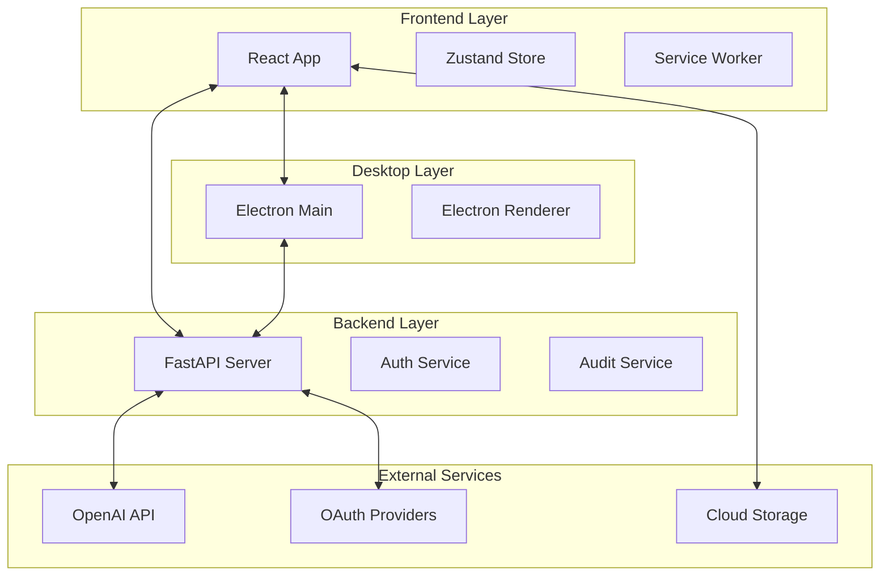

# Cross-System API Contracts and Communication Protocols

## Overview

This document defines the formal API contracts and communication protocols between all systems in the AI-Doc-Editor architecture, ensuring consistent interfaces and reliable inter-system communication.

## Table of Contents

1. [Architecture Overview](#architecture-overview)
2. [Frontend-Backend Contract](#frontend-backend-contract)
3. [Backend-OpenAI Integration](#backend-openai-integration)
4. [Desktop-Frontend Communication](#desktop-frontend-communication)
5. [Real-time Communication](#real-time-communication)
6. [Error Handling Contracts](#error-handling-contracts)
7. [Security Contracts](#security-contracts)
8. [Data Validation Contracts](#data-validation-contracts)
9. [Performance SLAs](#performance-slas)

## Architecture Overview

The AI-Doc-Editor system consists of multiple interconnected components:



## Frontend-Backend Contract

### Base Contract Specifications

```yaml
# API Contract Specification
version: "1.0.0"
base_url: "${API_BASE_URL}/api"
authentication:
  type: "Bearer JWT"
  refresh_mechanism: "automatic"
  token_expiry: 3600 # seconds

content_types:
  request: "application/json"
  response: "application/json"
  file_upload: "multipart/form-data"

standard_headers:
  required:
    - "Content-Type"
    - "Authorization" # For authenticated endpoints
  optional:
    - "X-Request-ID" # For tracing
    - "X-Client-Version" # For compatibility
```

### Authentication Contract

```typescript
interface AuthenticationContract {
  // Login Flow
  POST: {
    "/auth/login": {
      request: {
        query: {
          provider: "google" | "microsoft";
        };
      };
      response: {
        200: LoginResponse;
        400: BadRequestError;
        500: InternalServerError;
      };
      sla: {
        response_time: "< 500ms";
        availability: "99.9%";
      };
    };
  };

  // OAuth Callback
  GET: {
    "/auth/callback": {
      request: {
        query: {
          code: string;
          provider: string;
          state?: string;
        };
      };
      response: {
        200: TokenResponse;
        400: BadRequestError;
        500: InternalServerError;
      };
      sla: {
        response_time: "< 2000ms"; // OAuth can be slower
        availability: "99.9%";
      };
    };
  };

  // Token Refresh
  POST: {
    "/auth/refresh": {
      request: {
        body: {
          refresh_token: string;
        };
      };
      response: {
        200: TokenResponse;
        401: UnauthorizedError;
        422: ValidationError;
      };
      sla: {
        response_time: "< 200ms";
        availability: "99.95%";
      };
    };
  };

  // User Profile
  GET: {
    "/auth/me": {
      request: {
        headers: {
          Authorization: string; // Bearer token
        };
      };
      response: {
        200: UserResponse;
        401: UnauthorizedError;
        403: ForbiddenError;
      };
      sla: {
        response_time: "< 300ms";
        availability: "99.9%";
      };
    };
  };
}
```

### Health Monitoring Contract

```typescript
interface HealthContract {
  GET: {
    "/healthz": {
      request: {};
      response: {
        200: SimpleHealthResponse;
        503: ServiceUnavailableError;
      };
      sla: {
        response_time: "< 100ms";
        availability: "99.99%";
      };
      caching: {
        enabled: false; // Real-time health check
      };
    };

    "/health": {
      request: {};
      response: {
        200: ComprehensiveHealthResponse;
        503: ServiceUnavailableError;
      };
      sla: {
        response_time: "< 5000ms"; // Includes external dependency checks
        availability: "99.9%";
      };
      caching: {
        enabled: true;
        duration: "30s";
      };
    };
  };
}
```

### Audit Logs Contract

```typescript
interface AuditContract {
  // Admin-only endpoints
  security: {
    authentication: "required";
    authorization: "admin_only";
    rate_limiting: {
      requests_per_minute: 60;
      burst_allowance: 10;
    };
  };

  GET: {
    "/audit/logs": {
      request: {
        headers: {
          Authorization: string;
        };
        query: {
          limit?: number; // 1-1000, default 100
          offset?: number; // default 0
          action?: string;
          user_email?: string;
          start_date?: string; // ISO 8601
          end_date?: string; // ISO 8601
          ip_address?: string;
        };
      };
      response: {
        200: AuditLogListResponse;
        400: BadRequestError;
        401: UnauthorizedError;
        403: ForbiddenError;
        422: ValidationError;
      };
      sla: {
        response_time: "< 2000ms";
        availability: "99.9%";
      };
    };

    "/audit/stats": {
      request: {
        headers: {
          Authorization: string;
        };
      };
      response: {
        200: AuditLogStatsResponse;
        401: UnauthorizedError;
        403: ForbiddenError;
      };
      sla: {
        response_time: "< 1000ms";
        availability: "99.9%";
      };
    };
  };
}
```

### Data Contract Specifications

```typescript
// Standardized Response Format
interface StandardResponse<T = any> {
  success: boolean;
  data?: T;
  error?: {
    code: string;
    message: string;
    details?: Record<string, any>;
  };
  meta?: {
    timestamp: string;
    request_id?: string;
    api_version: string;
  };
}

// Error Response Format
interface ErrorResponse {
  error: string;
  message: string;
  details?: Record<string, any>;
  timestamp: string;
  path?: string;
  request_id?: string;
}

// Validation Error Format
interface ValidationError {
  error: "validation_error";
  message: string;
  details: Array<{
    field: string;
    message: string;
    type: string;
    value?: any;
  }>;
}
```

## Backend-OpenAI Integration

### OpenAI API Contract

```typescript
interface OpenAIIntegrationContract {
  // Chat Completions
  POST: {
    "https://api.openai.com/v1/chat/completions": {
      request: {
        headers: {
          "Authorization": string; // Bearer token
          "Content-Type": "application/json";
        };
        body: {
          model: string;
          messages: Array<{
            role: "system" | "user" | "assistant";
            content: string;
          }>;
          temperature?: number; // 0-2
          max_tokens?: number;
          stream?: boolean;
        };
      };
      response: {
        200: OpenAIChatResponse | OpenAIStreamResponse;
        400: OpenAIError;
        401: OpenAIError;
        429: OpenAIRateLimitError;
        500: OpenAIError;
      };
      retry_policy: {
        max_retries: 3;
        backoff: "exponential";
        retryable_errors: [429, 500, 502, 503, 504];
      };
      timeout: 30000; // 30 seconds
    };
  };

  // Error handling
  error_mapping: {
    invalid_api_key: "Authentication failed";
    insufficient_quota: "API quota exceeded";
    model_not_found: "Requested model not available";
    rate_limit_exceeded: "Too many requests";
  };
}
```

### OpenAI Response Processing Contract

```typescript
interface OpenAIProcessingContract {
  // Stream processing
  stream_handling: {
    chunk_delimiter: "\n\ndata: ";
    end_marker: "[DONE]";
    error_detection: {
      field: "error";
      required_fields: ["type", "message"];
    };
  };

  // Response validation
  validation: {
    required_fields: ["id", "object", "created", "choices"];
    choice_validation: {
      required_fields: ["index", "message"];
      message_validation: {
        required_fields: ["role", "content"];
      };
    };
  };

  // Token counting
  token_estimation: {
    method: "tiktoken";
    model_specific: true;
    safety_margin: 0.1; // 10% buffer
  };
}
```

## Desktop-Frontend Communication

### Electron IPC Contract

```typescript
interface ElectronIPCContract {
  // Main Process → Renderer Process
  main_to_renderer: {
    "app-ready": {
      payload: {
        version: string;
        platform: string;
        is_dev: boolean;
      };
    };
    "update-available": {
      payload: {
        version: string;
        release_notes: string;
        download_url?: string;
      };
    };
    "window-state-changed": {
      payload: {
        isMaximized: boolean;
        isMinimized: boolean;
        isFullScreen: boolean;
      };
    };
  };

  // Renderer Process → Main Process
  renderer_to_main: {
    "app-info-request": {
      payload: {};
      response: {
        version: string;
        platform: string;
        arch: string;
        node_version: string;
        electron_version: string;
      };
    };
    "file-save-dialog": {
      payload: {
        title?: string;
        defaultPath?: string;
        filters?: Array<{
          name: string;
          extensions: string[];
        }>;
      };
      response: {
        filePath?: string;
        cancelled: boolean;
      };
    };
    "file-open-dialog": {
      payload: {
        title?: string;
        defaultPath?: string;
        filters?: Array<{
          name: string;
          extensions: string[];
        }>;
        properties?: string[];
      };
      response: {
        filePaths: string[];
        cancelled: boolean;
      };
    };
  };

  // Security constraints
  security: {
    context_isolation: true;
    node_integration: false;
    preload_script: "required";
    allowed_origins: ["file://", "http://localhost:*"];
  };
}
```

### File System Integration Contract

```typescript
interface FileSystemContract {
  // File operations
  operations: {
    "fs:read-file": {
      input: {
        path: string;
        encoding?: "utf8" | "base64";
      };
      output: {
        success: boolean;
        content?: string;
        error?: string;
      };
      security: {
        path_validation: "required";
        allowed_extensions: [".md", ".txt", ".json", ".yaml"];
        sandbox: "user_documents";
      };
    };

    "fs:write-file": {
      input: {
        path: string;
        content: string;
        encoding?: "utf8" | "base64";
      };
      output: {
        success: boolean;
        error?: string;
      };
      security: {
        path_validation: "required";
        overwrite_protection: true;
        backup_creation: "automatic";
      };
    };

    "fs:list-directory": {
      input: {
        path: string;
        filter?: {
          extensions?: string[];
          include_hidden?: boolean;
        };
      };
      output: {
        success: boolean;
        files?: Array<{
          name: string;
          path: string;
          type: "file" | "directory";
          size: number;
          modified: string;
        }>;
        error?: string;
      };
    };
  };

  // Security policies
  security_policies: {
    allowed_directories: [
      "user_documents",
      "user_downloads",
      "app_data"
    ];
    forbidden_paths: [
      "system_root",
      "program_files",
      "windows_system"
    ];
    file_size_limits: {
      read: "10MB";
      write: "50MB";
    };
  };
}
```

## Real-time Communication

### WebSocket Contract

```typescript
interface WebSocketContract {
  // Connection establishment
  connection: {
    url: "wss://api.ai-doc-editor.com/ws";
    protocols: ["ai-doc-editor-v1"];
    authentication: {
      method: "query_param";
      parameter: "token";
      format: "jwt";
    };
    heartbeat: {
      interval: 30000; // 30 seconds
      timeout: 10000; // 10 seconds
    };
  };

  // Message format
  message_format: {
    type: "json";
    schema: {
      id: string; // Unique message ID
      type: string; // Message type
      payload: any; // Type-specific payload
      timestamp: string; // ISO 8601
      sender?: string; // Optional sender ID
    };
  };

  // Message types
  message_types: {
    // Document collaboration
    "document:update": {
      payload: {
        document_id: string;
        operation: "insert" | "delete" | "format";
        position: number;
        content?: string;
        user_id: string;
      };
    };

    "document:cursor": {
      payload: {
        document_id: string;
        user_id: string;
        position: number;
        selection?: {
          start: number;
          end: number;
        };
      };
    };

    // System notifications
    "system:notification": {
      payload: {
        level: "info" | "warning" | "error";
        title: string;
        message: string;
        actions?: Array<{
          label: string;
          action: string;
        }>;
      };
    };

    // Presence tracking
    "user:join": {
      payload: {
        user_id: string;
        user_name: string;
        document_id: string;
      };
    };

    "user:leave": {
      payload: {
        user_id: string;
        document_id: string;
      };
    };
  };

  // Error handling
  error_handling: {
    connection_errors: {
      "4001": "Authentication failed";
      "4002": "Authorization required";
      "4003": "Rate limit exceeded";
      "4004": "Document not found";
    };
    reconnection: {
      max_attempts: 5;
      backoff: "exponential";
      initial_delay: 1000;
      max_delay: 30000;
    };
  };
}
```

## Error Handling Contracts

### Standard Error Codes

```typescript
interface ErrorCodeContract {
  // HTTP Status Code Mapping
  http_status_mapping: {
    400: "BadRequestError";
    401: "UnauthorizedError";
    403: "ForbiddenError";
    404: "NotFoundError";
    409: "ConflictError";
    422: "ValidationError";
    429: "RateLimitError";
    500: "InternalServerError";
    502: "BadGatewayError";
    503: "ServiceUnavailableError";
    504: "TimeoutError";
  };

  // Application-specific error codes
  application_errors: {
    "AUTH_001": "Invalid credentials";
    "AUTH_002": "Token expired";
    "AUTH_003": "Insufficient permissions";
    "DOC_001": "Document not found";
    "DOC_002": "Document locked by another user";
    "DOC_003": "Document version conflict";
    "AI_001": "AI service unavailable";
    "AI_002": "Token limit exceeded";
    "AI_003": "Content filtering triggered";
    "SYS_001": "Database connection failed";
    "SYS_002": "External service timeout";
    "SYS_003": "Configuration error";
  };

  // Error response format
  error_format: {
    code: string; // Application error code
    message: string; // Human-readable message
    details?: Record<string, any>; // Additional context
    timestamp: string; // ISO 8601
    request_id?: string; // For tracing
    retry_after?: number; // For rate limits
  };
}
```

### Retry Policies

```typescript
interface RetryPolicyContract {
  // Default retry configuration
  default_policy: {
    max_attempts: 3;
    backoff_strategy: "exponential";
    base_delay: 1000; // 1 second
    max_delay: 30000; // 30 seconds
    jitter: true; // Add randomization
  };

  // Endpoint-specific policies
  endpoint_policies: {
    "/auth/refresh": {
      max_attempts: 1; // Don't retry auth failures
      backoff_strategy: "none";
    };
    "/audit/logs": {
      max_attempts: 2; // Limited retries for admin endpoints
      backoff_strategy: "linear";
      base_delay: 500;
    };
    "/health": {
      max_attempts: 5; // Health checks are critical
      backoff_strategy: "exponential";
      base_delay: 100;
      max_delay: 5000;
    };
  };

  // Retryable conditions
  retryable_conditions: {
    http_status: [429, 500, 502, 503, 504];
    network_errors: ["ECONNRESET", "ENOTFOUND", "ETIMEDOUT"];
    custom_errors: ["AI_001", "SYS_001", "SYS_002"];
  };

  // Non-retryable conditions
  non_retryable_conditions: {
    http_status: [400, 401, 403, 404, 422];
    custom_errors: ["AUTH_001", "AUTH_002", "DOC_001"];
  };
}
```

## Security Contracts

### Authentication Security

```typescript
interface AuthenticationSecurityContract {
  // JWT token specifications
  jwt_tokens: {
    access_token: {
      algorithm: "HS256" | "RS256";
      expiry: 3600; // 1 hour
      issuer: "ai-doc-editor-api";
      audience: "ai-doc-editor-frontend";
      claims: {
        sub: string; // User ID
        email: string;
        role: string;
        iat: number; // Issued at
        exp: number; // Expires at
        jti: string; // JWT ID for revocation
      };
    };
    refresh_token: {
      algorithm: "HS256" | "RS256";
      expiry: 2592000; // 30 days
      claims: {
        sub: string; // User ID
        type: "refresh";
        iat: number;
        exp: number;
        jti: string;
      };
    };
  };

  // OAuth security requirements
  oauth_security: {
    state_parameter: {
      required: true;
      entropy: 128; // bits
      expiry: 300; // 5 minutes
    };
    pkce: {
      required: true; // For public clients
      code_challenge_method: "S256";
    };
    redirect_uri: {
      validation: "strict";
      allowed_schemes: ["https", "http"]; // http only for localhost
      localhost_exception: true;
    };
  };

  // Rate limiting
  rate_limits: {
    login_attempts: {
      window: 900; // 15 minutes
      max_attempts: 5;
      lockout_duration: 3600; // 1 hour
    };
    token_refresh: {
      window: 60; // 1 minute
      max_attempts: 10;
    };
  };
}
```

### Data Protection

```typescript
interface DataProtectionContract {
  // Encryption requirements
  encryption: {
    at_rest: {
      algorithm: "AES-256-GCM";
      key_rotation: "quarterly";
      key_management: "HSM" | "KMS";
    };
    in_transit: {
      protocol: "TLS 1.3";
      cipher_suites: ["TLS_AES_256_GCM_SHA384"];
      certificate_validation: "strict";
    };
  };

  // PII handling
  pii_protection: {
    classification: {
      public: ["user_id", "role"];
      confidential: ["email", "name"];
      restricted: ["ip_address", "session_data"];
    };
    anonymization: {
      audit_logs: {
        ip_masking: "last_octet";
        email_hashing: "sha256";
      };
    };
    retention: {
      user_data: "2_years";
      audit_logs: "7_years";
      session_data: "24_hours";
    };
  };

  // Audit requirements
  audit_trail: {
    required_events: [
      "user_login",
      "user_logout",
      "data_access",
      "data_modification",
      "permission_change",
      "system_config_change"
    ];
    log_format: "structured_json";
    immutability: "WORM"; // Write-Once-Read-Many
    integrity: "digital_signature";
  };
}
```

## Data Validation Contracts

### Input Validation

```typescript
interface InputValidationContract {
  // Global validation rules
  global_rules: {
    string_limits: {
      min_length: 0;
      max_length: 10000; // Configurable per field
      allowed_chars: "unicode"; // or specific character sets
    };
    numeric_limits: {
      integer: {
        min: -2147483648;
        max: 2147483647;
      };
      float: {
        precision: 15;
        scale: 6;
      };
    };
    array_limits: {
      max_items: 1000;
      max_depth: 10; // For nested arrays/objects
    };
  };

  // Field-specific validation
  field_validation: {
    email: {
      pattern: "^[a-zA-Z0-9._%+-]+@[a-zA-Z0-9.-]+\\.[a-zA-Z]{2,}$";
      max_length: 254;
      normalization: "lowercase";
    };
    password: {
      min_length: 8;
      max_length: 128;
      complexity: {
        uppercase: 1;
        lowercase: 1;
        digits: 1;
        special_chars: 1;
      };
    };
    user_role: {
      enum: ["viewer", "editor", "admin"];
      case_sensitive: false;
    };
    document_id: {
      pattern: "^[a-zA-Z0-9_-]+$";
      min_length: 1;
      max_length: 64;
    };
  };

  // Sanitization rules
  sanitization: {
    html_content: {
      strategy: "whitelist";
      allowed_tags: ["p", "strong", "em", "ul", "ol", "li"];
      allowed_attributes: ["class", "id"];
    };
    file_uploads: {
      allowed_extensions: [".md", ".txt", ".json"];
      max_size: "10MB";
      virus_scanning: "required";
    };
    sql_injection: {
      detection: "parameterized_queries";
      escaping: "automatic";
    };
  };
}
```

## Performance SLAs

### Response Time Requirements

```typescript
interface PerformanceSLAContract {
  // Response time targets (95th percentile)
  response_times: {
    authentication: {
      login_initiation: "< 500ms";
      oauth_callback: "< 2000ms";
      token_refresh: "< 200ms";
      user_profile: "< 300ms";
    };
    health_checks: {
      simple_health: "< 100ms";
      comprehensive_health: "< 5000ms";
    };
    audit_operations: {
      log_retrieval: "< 2000ms";
      statistics: "< 1000ms";
      export: "< 30000ms"; // Large data export
    };
    document_operations: {
      create: "< 1000ms";
      read: "< 500ms";
      update: "< 800ms";
      delete: "< 300ms";
    };
  };

  // Throughput requirements
  throughput: {
    authentication: {
      login_requests: "100 req/min per IP";
      token_refresh: "1000 req/min total";
    };
    api_endpoints: {
      read_operations: "10000 req/min total";
      write_operations: "1000 req/min total";
    };
    websocket: {
      concurrent_connections: 1000;
      messages_per_second: 10000;
    };
  };

  // Availability targets
  availability: {
    overall_system: "99.9%"; // 8.76 hours downtime per year
    authentication: "99.95%"; // 4.38 hours downtime per year
    health_endpoints: "99.99%"; // 52.56 minutes downtime per year
    planned_maintenance: "< 4 hours per month";
  };

  // Error rate thresholds
  error_rates: {
    http_5xx_errors: "< 0.1%";
    authentication_failures: "< 0.01%";
    websocket_disconnections: "< 1%";
    data_corruption: "0%"; // Zero tolerance
  };
}
```

### Monitoring and Alerting

```typescript
interface MonitoringContract {
  // Metrics collection
  metrics: {
    response_times: {
      collection_interval: "1s";
      aggregation: ["p50", "p95", "p99"];
      retention: "30 days";
    };
    error_rates: {
      collection_interval: "1s";
      alerting_threshold: "0.1%";
      escalation_threshold: "1%";
    };
    resource_usage: {
      cpu: "every 30s";
      memory: "every 30s";
      disk: "every 5m";
      network: "every 1m";
    };
  };

  // Alerting rules
  alerts: {
    critical: {
      system_down: {
        condition: "availability < 99%";
        notification: "immediate";
        escalation: "5 minutes";
      };
      data_breach: {
        condition: "unauthorized_access_detected";
        notification: "immediate";
        escalation: "immediate";
      };
    };
    warning: {
      high_response_time: {
        condition: "p95_response_time > SLA + 50%";
        notification: "5 minutes";
        escalation: "15 minutes";
      };
      elevated_error_rate: {
        condition: "error_rate > 0.05%";
        notification: "2 minutes";
        escalation: "10 minutes";
      };
    };
  };

  // Health check endpoints
  health_endpoints: {
    "/health": {
      check_interval: "30s";
      timeout: "5s";
      retry_count: 3;
    };
    "/healthz": {
      check_interval: "10s";
      timeout: "1s";
      retry_count: 1;
    };
  };
}
```

## Contract Validation and Testing

### Contract Testing Strategy

```typescript
interface ContractTestingContract {
  // Provider tests (Backend)
  provider_tests: {
    test_framework: "pytest";
    contract_verification: "pact";
    test_coverage: "> 90%";
    test_types: [
      "unit_tests",
      "integration_tests",
      "contract_tests",
      "performance_tests"
    ];
  };

  // Consumer tests (Frontend)
  consumer_tests: {
    test_framework: "jest + playwright";
    mock_generation: "automatic";
    test_coverage: "> 85%";
    test_types: [
      "component_tests",
      "integration_tests",
      "e2e_tests",
      "contract_tests"
    ];
  };

  // Cross-system testing
  cross_system_tests: {
    environment: "staging";
    automation: "CI/CD pipeline";
    schedule: "on every deployment";
    rollback_trigger: "contract_violation";
  };

  // Contract evolution
  contract_evolution: {
    backward_compatibility: "required";
    deprecation_notice: "3 months minimum";
    version_support: "2 major versions";
    breaking_change_process: [
      "proposal",
      "review",
      "implementation",
      "migration_period",
      "deprecation"
    ];
  };
}
```

This comprehensive contract specification ensures reliable, secure, and performant communication between all systems in the AI-Doc-Editor architecture while providing clear guidelines for development, testing, and maintenance.