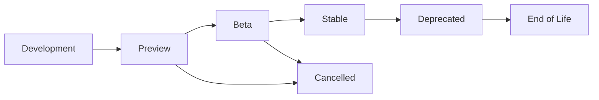
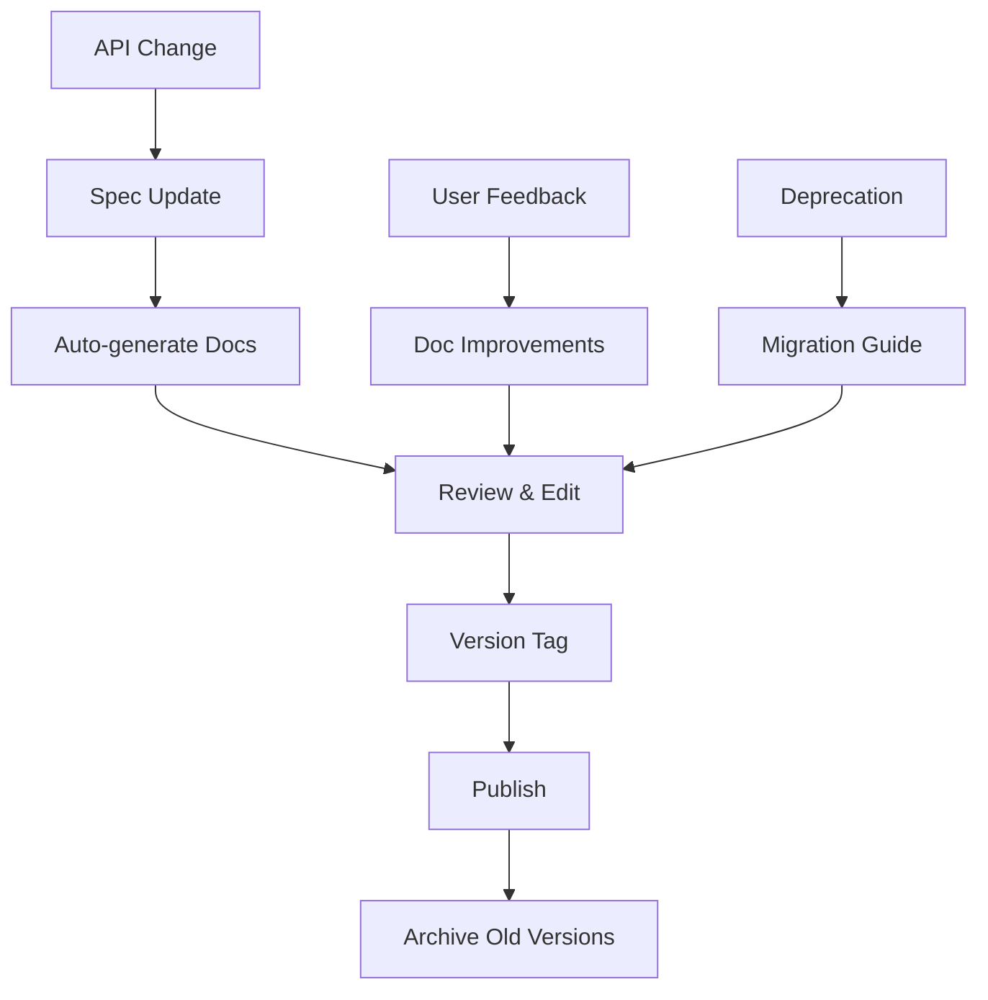
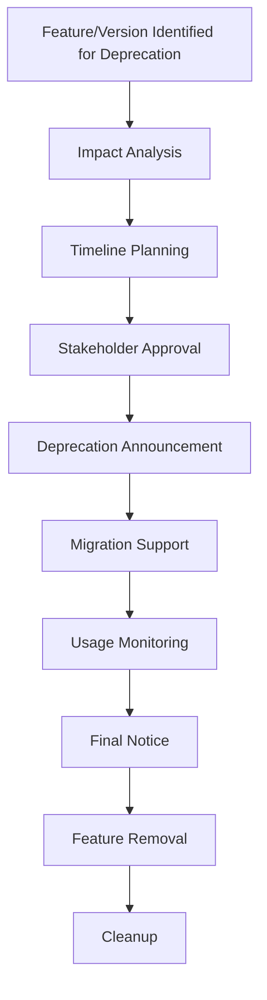

# API Versioning and Evolution Strategy

## Overview

This document defines the comprehensive versioning strategy and evolution policies for all APIs in the AI-Doc-Editor system, ensuring backward compatibility, smooth migrations, and sustainable long-term development.

## Table of Contents

1. [Versioning Philosophy](#versioning-philosophy)
2. [Versioning Schemes](#versioning-schemes)
3. [API Lifecycle Management](#api-lifecycle-management)
4. [Backward Compatibility](#backward-compatibility)
5. [Migration Strategies](#migration-strategies)
6. [Breaking Change Management](#breaking-change-management)
7. [Documentation Versioning](#documentation-versioning)
8. [Client SDK Versioning](#client-sdk-versioning)
9. [Testing and Validation](#testing-and-validation)
10. [Deprecation Process](#deprecation-process)

## Versioning Philosophy

### Core Principles

1. **Backward Compatibility First**: Maintain compatibility for existing clients
2. **Semantic Versioning**: Follow SemVer principles for clear change communication
3. **Gradual Evolution**: Introduce changes incrementally with proper migration paths
4. **Client-Centric Design**: Prioritize client experience and migration ease
5. **Documentation Synchronization**: Keep documentation aligned with API versions

### Version Support Policy

```yaml
version_support:
  major_versions:
    supported_simultaneously: 2
    support_duration: "24 months minimum"
    end_of_life_notice: "12 months advance"

  minor_versions:
    backward_compatibility: "guaranteed"
    deprecation_notice: "6 months minimum"

  patch_versions:
    compatibility: "always maintained"
    security_patches: "immediate backport"
```

## Versioning Schemes

### URL-Based Versioning (Primary)

```typescript
// API Base URL Structure
interface APIVersioning {
  base_url: "https://api.ai-doc-editor.com";
  version_pattern: "/v{major}";

  examples: {
    v1: "https://api.ai-doc-editor.com/v1/auth/login";
    v2: "https://api.ai-doc-editor.com/v2/auth/login";
    latest: "https://api.ai-doc-editor.com/v2/auth/login"; // Points to latest stable
  };

  // Version routing
  routing_rules: {
    no_version_specified: "redirect_to_latest";
    invalid_version: "return_404_with_available_versions";
    deprecated_version: "return_warning_header";
  };
}
```

### Header-Based Versioning (Alternative)

```typescript
// Alternative versioning via headers
interface HeaderVersioning {
  header_name: "API-Version";
  default_version: "1.0";

  examples: {
    "API-Version: 1.0": "Use v1 API";
    "API-Version: 2.0": "Use v2 API";
    "API-Version: latest": "Use latest stable version";
  };

  // Content negotiation
  accept_version_header: "Accept-Version";
  version_response_header: "API-Version-Used";
}
```

### Semantic Versioning Structure

```yaml
semantic_versioning:
  format: "MAJOR.MINOR.PATCH"

  major_version:
    triggers:
      - "Breaking API changes"
      - "Fundamental architecture changes"
      - "Database schema breaking changes"
      - "Authentication method changes"
    examples:
      - "1.0.0 → 2.0.0: OAuth 1.0 to OAuth 2.0 migration"
      - "2.0.0 → 3.0.0: REST to GraphQL transition"

  minor_version:
    triggers:
      - "New endpoint additions"
      - "New optional parameters"
      - "New response fields"
      - "Performance improvements"
    examples:
      - "1.0.0 → 1.1.0: Added audit logs endpoint"
      - "1.1.0 → 1.2.0: Added document collaboration features"

  patch_version:
    triggers:
      - "Bug fixes"
      - "Security patches"
      - "Documentation updates"
      - "Internal optimizations"
    examples:
      - "1.1.0 → 1.1.1: Fixed authentication token refresh"
      - "1.1.1 → 1.1.2: Security patch for SQL injection"
```

## API Lifecycle Management

### Lifecycle Stages



### Stage Definitions

```typescript
interface APILifecycleStages {
  development: {
    description: "Internal development, not public";
    stability: "unstable";
    support: "none";
    documentation: "internal only";
    testing: "unit tests only";
  };

  preview: {
    description: "Early access for selected partners";
    stability: "unstable";
    support: "best effort";
    documentation: "limited public";
    testing: "integration tests";
    sla: "none";
    rate_limits: "relaxed";
  };

  beta: {
    description: "Public preview with feedback collection";
    stability: "limited breaking changes";
    support: "business hours";
    documentation: "complete public";
    testing: "full test suite";
    sla: "95% uptime";
    rate_limits: "production-like";
    feedback_collection: "active";
  };

  stable: {
    description: "Production-ready with full support";
    stability: "backward compatible only";
    support: "24/7";
    documentation: "comprehensive";
    testing: "full automation + manual";
    sla: "99.9% uptime";
    rate_limits: "production";
    monitoring: "full";
  };

  deprecated: {
    description: "Marked for removal, discouraged use";
    stability: "maintenance only";
    support: "limited";
    documentation: "migration guides";
    testing: "regression tests only";
    sla: "best effort";
    sunset_date: "announced";
  };

  end_of_life: {
    description: "No longer supported or available";
    stability: "none";
    support: "none";
    documentation: "archived";
    testing: "none";
    access: "disabled";
  };
}
```

### Version Progression Example

```yaml
ai_doc_editor_api_versions:
  v1.0.0:
    release_date: "2024-01-15"
    status: "stable"
    features:
      - "Basic authentication"
      - "Document CRUD operations"
      - "Health checks"

  v1.1.0:
    release_date: "2024-03-01"
    status: "stable"
    features:
      - "OAuth 2.0 authentication"
      - "Audit logging"
      - "User management"

  v1.2.0:
    release_date: "2024-05-15"
    status: "stable"
    features:
      - "Real-time collaboration"
      - "Document versioning"
      - "Advanced search"

  v2.0.0:
    release_date: "2024-08-01"
    status: "beta"
    features:
      - "GraphQL API introduction"
      - "Enhanced security model"
      - "Microservices architecture"
    breaking_changes:
      - "Authentication endpoint restructure"
      - "Response format standardization"
      - "Rate limiting changes"
```

## Backward Compatibility

### Compatibility Guarantees

```typescript
interface BackwardCompatibilityContract {
  // What we guarantee to maintain
  guaranteed_stable: {
    endpoint_urls: "URLs within same major version";
    request_formats: "Required fields and data types";
    response_formats: "Existing fields and structure";
    authentication: "Token format and validation";
    error_codes: "Existing error code meanings";
    rate_limits: "Announced limits won't decrease";
  };

  // What can change without breaking compatibility
  allowed_changes: {
    new_endpoints: "Addition of new API endpoints";
    new_optional_fields: "Optional request parameters";
    new_response_fields: "Additional response data";
    performance_improvements: "Faster response times";
    security_enhancements: "Strengthened security";
    bug_fixes: "Correction of documented behavior";
  };

  // What requires major version bump
  breaking_changes: {
    endpoint_removal: "Removing or renaming endpoints";
    required_fields: "Making optional fields required";
    field_removal: "Removing response fields";
    data_type_changes: "Changing field data types";
    authentication_changes: "Changing auth mechanisms";
    behavior_changes: "Altering documented behavior";
  };
}
```

### Compatibility Testing

```typescript
interface CompatibilityTesting {
  // Automated compatibility tests
  automated_tests: {
    contract_tests: {
      framework: "pact";
      frequency: "every commit";
      coverage: "all public endpoints";
    };

    regression_tests: {
      framework: "pytest + newman";
      frequency: "nightly";
      scope: "previous 2 major versions";
    };

    schema_validation: {
      tool: "openapi-diff";
      check: "no breaking changes";
      integration: "CI/CD pipeline";
    };
  };

  // Manual testing process
  manual_testing: {
    client_simulation: {
      test_clients: ["postman", "curl", "custom_scripts"];
      scenarios: "real_world_usage_patterns";
      frequency: "before each release";
    };

    partner_validation: {
      early_access: "2 weeks before release";
      feedback_period: "1 week";
      sign_off_required: true;
    };
  };
}
```

## Migration Strategies

### Migration Types and Approaches

```typescript
interface MigrationStrategies {
  // Gradual migration (recommended)
  gradual_migration: {
    description: "Side-by-side operation of old and new versions";
    implementation: {
      dual_endpoints: "Both v1 and v2 available simultaneously";
      proxy_layer: "Route requests based on version header";
      data_sync: "Maintain consistency between versions";
      monitoring: "Track usage patterns and migration progress";
    };

    timeline: {
      announcement: "3 months before new version";
      beta_release: "2 months overlap";
      stable_release: "6 months overlap";
      deprecation: "12 months notice";
      sunset: "24 months total support";
    };
  };

  // Feature flag migration
  feature_flag_migration: {
    description: "Toggle new features per client";
    implementation: {
      client_flags: "Per-client feature enablement";
      gradual_rollout: "Percentage-based activation";
      rollback_capability: "Instant rollback on issues";
      telemetry: "Monitor feature usage and performance";
    };

    benefits: [
      "Risk mitigation",
      "Granular control",
      "Easy rollback",
      "Data-driven decisions"
    ];
  };

  // Adapter pattern migration
  adapter_migration: {
    description: "Translate between old and new API formats";
    implementation: {
      translation_layer: "Convert requests/responses";
      backward_compatibility: "Maintain old interface";
      performance_optimization: "Minimize translation overhead";
      sunset_planning: "Remove adapters after migration";
    };

    use_cases: [
      "Minor format changes",
      "Field renaming",
      "Structure reorganization"
    ];
  };
}
```

### Migration Tooling

```typescript
interface MigrationTools {
  // Automated migration tools
  automation: {
    schema_migration: {
      tool: "alembic";
      versioning: "sequential";
      rollback: "automatic";
      testing: "migration_tests";
    };

    client_generation: {
      tool: "openapi-generator";
      languages: ["typescript", "python", "java"];
      versioning: "semantic";
      publication: "npm + pypi";
    };

    documentation_sync: {
      tool: "custom_pipeline";
      source: "openapi_spec";
      outputs: ["web_docs", "pdf", "markdown"];
      versioning: "git_tags";
    };
  };

  // Developer tools
  developer_tools: {
    version_diff: {
      tool: "api-diff";
      output: "breaking_changes_report";
      integration: "pull_request_comments";
    };

    migration_guide_generator: {
      input: "api_diff + templates";
      output: "step_by_step_migration_guide";
      personalization: "client_specific_changes";
    };

    compatibility_checker: {
      tool: "openapi-compatibility";
      check_level: "strict";
      failure_action: "block_deployment";
    };
  };
}
```

## Breaking Change Management

### Breaking Change Categories

```typescript
interface BreakingChangeManagement {
  // Category classification
  categories: {
    critical: {
      description: "Security or data integrity issues";
      timeline: "immediate with hotfix process";
      communication: "emergency notification";
      examples: [
        "Authentication vulnerability fix",
        "Data corruption prevention"
      ];
    };

    major: {
      description: "Significant API restructuring";
      timeline: "12+ months notice";
      communication: "formal announcement + migration guide";
      examples: [
        "Endpoint URL changes",
        "Authentication method changes",
        "Response format overhaul"
      ];
    };

    minor: {
      description: "Limited scope breaking changes";
      timeline: "6 months notice";
      communication: "developer newsletter + docs";
      examples: [
        "Field removal",
        "Validation rule tightening",
        "Default value changes"
      ];
    };
  };

  // Change approval process
  approval_process: {
    proposal: {
      required_sections: [
        "motivation",
        "alternatives_considered",
        "migration_path",
        "timeline",
        "impact_assessment"
      ];
      stakeholders: ["product", "engineering", "devrel"];
      approval_criteria: "unanimous for critical, majority for others";
    };

    implementation: {
      feature_flag_first: true;
      limited_rollout: "5% → 25% → 50% → 100%";
      monitoring_period: "2 weeks per stage";
      rollback_plan: "required";
    };
  };
}
```

### Change Communication Process

```typescript
interface ChangeCommunication {
  // Communication channels
  channels: {
    emergency: {
      methods: ["email", "slack", "status_page"];
      timing: "immediate";
      audience: "all_users";
    };

    planned_changes: {
      methods: ["developer_blog", "email_newsletter", "docs"];
      timing: "timeline_based";
      audience: "affected_users";
    };

    minor_updates: {
      methods: ["changelog", "release_notes"];
      timing: "with_release";
      audience: "interested_users";
    };
  };

  // Communication templates
  templates: {
    breaking_change_announcement: {
      subject: "[BREAKING CHANGE] {API_NAME} v{VERSION} - {SUMMARY}";
      sections: [
        "what_is_changing",
        "why_we_are_making_this_change",
        "timeline",
        "migration_guide",
        "support_contacts"
      ];
      advance_notice: "minimum 6 months";
    };

    deprecation_notice: {
      subject: "[DEPRECATION] {ENDPOINT} - End of Life {DATE}";
      sections: [
        "deprecated_feature",
        "replacement_options",
        "migration_timeline",
        "support_resources"
      ];
      channels: ["api_responses", "docs", "email"];
    };
  };
}
```

## Documentation Versioning

### Documentation Strategy

```typescript
interface DocumentationVersioning {
  // Versioning approach
  versioning_strategy: {
    synchronized: {
      description: "Docs versioned with API";
      structure: "/docs/v{major}.{minor}/";
      maintenance: "parallel maintenance";
      migration: "automated where possible";
    };

    canonical: {
      description: "Single doc source with version annotations";
      structure: "/docs/ with version tags";
      maintenance: "single source of truth";
      migration: "version-specific sections";
    };
  };

  // Documentation types
  document_types: {
    api_reference: {
      source: "openapi_specification";
      generation: "automatic";
      versioning: "per_major_version";
      format: ["html", "pdf", "postman_collection"];
    };

    user_guides: {
      source: "markdown_files";
      generation: "manual + automation";
      versioning: "per_minor_version";
      format: ["web", "pdf"];
    };

    migration_guides: {
      source: "change_analysis + templates";
      generation: "semi_automatic";
      versioning: "per_breaking_change";
      format: ["web", "interactive"];
    };

    code_examples: {
      source: "working_code + tests";
      generation: "extracted_from_tests";
      versioning: "per_major_version";
      format: ["inline", "downloadable"];
    };
  };
}
```

### Documentation Lifecycle



## Client SDK Versioning

### SDK Versioning Strategy

```typescript
interface SDKVersioning {
  // SDK generation and versioning
  generation_strategy: {
    automatic: {
      source: "openapi_specification";
      tools: ["openapi-generator", "custom-templates"];
      languages: ["typescript", "python", "java", "go"];
      versioning: "semantic + api_version_tag";
    };

    version_mapping: {
      api_v1: "sdk_1.x.x";
      api_v2: "sdk_2.x.x";
      breaking_api_change: "sdk_major_bump";
      feature_addition: "sdk_minor_bump";
      bug_fix: "sdk_patch_bump";
    };
  };

  // Multi-version support
  multi_version_support: {
    strategy: "parallel_sdks";
    support_policy: "latest_2_major_versions";
    deprecation_process: {
      announcement: "6_months_advance";
      final_warning: "3_months_advance";
      removal: "with_api_version_removal";
    };
  };

  // SDK distribution
  distribution: {
    typescript: {
      registry: "npm";
      package_name: "@ai-doc-editor/api-client";
      versioning: "semver";
      tags: ["latest", "beta", "v1", "v2"];
    };

    python: {
      registry: "pypi";
      package_name: "ai-doc-editor-client";
      versioning: "semver";
      python_versions: ["3.8+"];
    };

    java: {
      registry: "maven_central";
      group_id: "com.ai-doc-editor";
      artifact_id: "api-client";
      versioning: "semver";
    };
  };
}
```

### SDK Migration Support

```typescript
interface SDKMigrationSupport {
  // Migration utilities
  migration_tools: {
    version_checker: {
      functionality: "Check API compatibility";
      usage: "client.checkApiVersion()";
      response: {
        compatible: boolean;
        current_version: string;
        required_version: string;
        migration_guide_url: string;
      };
    };

    auto_migration: {
      functionality: "Automatic request/response transformation";
      implementation: "adapter_pattern";
      fallback: "manual_migration_guide";
    };

    deprecation_warnings: {
      functionality: "Runtime warnings for deprecated features";
      levels: ["info", "warning", "error"];
      configuration: "client_side_settings";
    };
  };

  // Documentation and examples
  migration_resources: {
    migration_guides: {
      format: "step_by_step";
      examples: "before_and_after_code";
      automation: "script_templates";
    };

    compatibility_matrix: {
      format: "table";
      dimensions: ["sdk_version", "api_version", "features"];
      updates: "automatic";
    };

    changelog: {
      format: "structured_markdown";
      sections: ["breaking_changes", "new_features", "bug_fixes"];
      linking: "issue_tracking";
    };
  };
}
```

## Testing and Validation

### Versioning Test Strategy

```typescript
interface VersioningTestStrategy {
  // Test categories
  test_categories: {
    compatibility_tests: {
      description: "Ensure new versions work with existing clients";
      framework: "pact + custom";
      frequency: "every commit";
      coverage: "all public interfaces";
    };

    migration_tests: {
      description: "Validate migration paths work correctly";
      framework: "integration tests";
      frequency: "before release";
      scenarios: "real world migration paths";
    };

    version_negotiation_tests: {
      description: "Test version selection logic";
      framework: "unit + integration";
      frequency: "every commit";
      coverage: "all version selection scenarios";
    };

    backward_compatibility_tests: {
      description: "Ensure old clients continue working";
      framework: "regression tests";
      frequency: "before release";
      retention: "2 major versions";
    };
  };

  // Test environments
  test_environments: {
    development: {
      purpose: "Unit and integration tests";
      data: "synthetic";
      versions: "current development";
    };

    staging: {
      purpose: "End-to-end testing";
      data: "production-like";
      versions: "current + previous major";
    };

    production_mirror: {
      purpose: "Final validation";
      data: "production subset";
      versions: "all supported versions";
    };
  };
}
```

### Automated Validation Pipeline

```yaml
validation_pipeline:
  pre_commit:
    - schema_validation
    - breaking_change_detection
    - unit_tests

  pull_request:
    - compatibility_tests
    - integration_tests
    - documentation_build

  pre_release:
    - migration_tests
    - performance_tests
    - security_scans

  post_release:
    - monitoring_setup
    - client_notification
    - documentation_update
```

## Deprecation Process

### Deprecation Workflow



### Deprecation Stages

```typescript
interface DeprecationProcess {
  // Deprecation stages
  stages: {
    evaluation: {
      duration: "1-2 months";
      activities: [
        "usage_analysis",
        "impact_assessment",
        "alternative_evaluation",
        "stakeholder_consultation"
      ];
      deliverables: ["deprecation_proposal", "migration_plan"];
    };

    announcement: {
      duration: "immediate";
      activities: [
        "public_announcement",
        "documentation_update",
        "sdk_warnings",
        "support_team_training"
      ];
      deliverables: ["deprecation_notice", "migration_guide"];
    };

    migration_support: {
      duration: "6-12 months";
      activities: [
        "developer_support",
        "migration_tooling",
        "usage_monitoring",
        "feedback_collection"
      ];
      deliverables: ["migration_tools", "support_metrics"];
    };

    sunset: {
      duration: "3 months";
      activities: [
        "final_notice",
        "access_restriction",
        "feature_removal",
        "cleanup"
      ];
      deliverables: ["removal_confirmation", "cleanup_report"];
    };
  };

  // Deprecation criteria
  deprecation_triggers: {
    low_usage: "< 5% of total API calls";
    security_risk: "unfixable security vulnerability";
    technical_debt: "blocking architectural improvements";
    cost_benefit: "maintenance cost > business value";
    strategic_shift: "business model or strategy change";
  };
}
```

### Deprecation Communication

```typescript
interface DeprecationCommunication {
  // Communication timeline
  timeline: {
    initial_announcement: "12 months before removal";
    quarterly_reminders: "every 3 months";
    final_warning: "3 months before removal";
    last_chance: "1 month before removal";
    removal_confirmation: "on removal date";
  };

  // Communication content
  message_content: {
    deprecation_notice: {
      what: "What is being deprecated";
      why: "Reason for deprecation";
      when: "Timeline for removal";
      alternative: "Recommended migration path";
      support: "Available support resources";
    };

    migration_guide: {
      step_by_step: "Detailed migration instructions";
      code_examples: "Before and after code samples";
      tools: "Automated migration tools";
      timeline: "Recommended migration schedule";
      support: "Help and support contacts";
    };
  };

  // Delivery mechanisms
  delivery: {
    in_api_responses: {
      header: "Deprecated: true";
      sunset_header: "Sunset: 2024-12-31";
      link_header: "rel=migration-guide";
    };

    documentation: {
      deprecation_badges: "visual indicators";
      migration_section: "prominent placement";
      cross_links: "to replacement features";
    };

    direct_communication: {
      email_campaigns: "targeted to affected users";
      developer_newsletter: "regular updates";
      support_notifications: "proactive outreach";
    };
  };
}
```

This comprehensive versioning strategy ensures that the AI-Doc-Editor API can evolve sustainably while maintaining excellent developer experience and minimizing disruption to existing integrations.