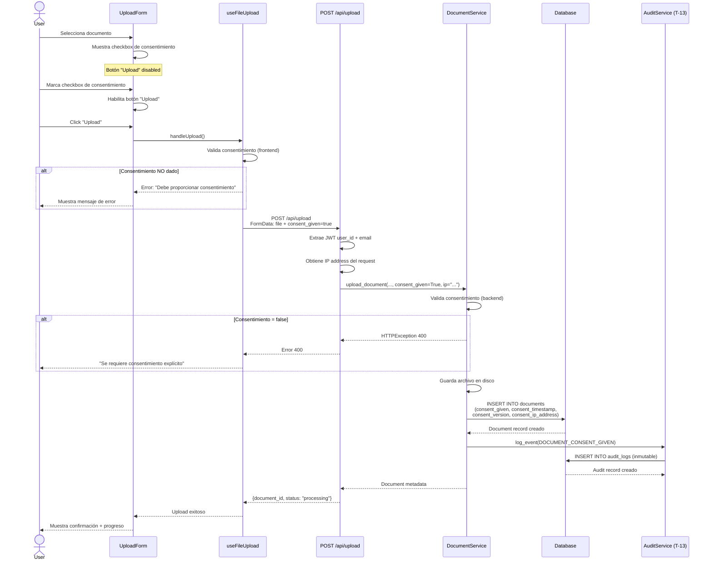

# Sistema de Gestión de Consentimiento

**Task:** T-24 - Consent Management
**Estado:** ✅ Completado (2025-10-24)
**Propósito:** Cumplimiento legal GDPR/CCPA para procesamiento de documentos con IA

---

## Descripción General

El Sistema de Gestión de Consentimiento implementa el registro explícito y auditable del consentimiento del usuario antes de enviar documentos a servicios de IA para análisis y procesamiento. Este sistema garantiza el cumplimiento legal con GDPR (Reglamento General de Protección de Datos) y otras regulaciones de privacidad.

### Características Principales

- ✅ **Consentimiento Explícito**: Checkbox obligatorio antes de subir documentos
- ✅ **Registro Inmutable**: Auditoría WORM (Write Once, Read Many) mediante T-13
- ✅ **Trazabilidad Completa**: IP, timestamp, versión del consentimiento
- ✅ **Bloqueo Preventivo**: Frontend y backend validan consentimiento antes de procesar
- ✅ **Versionado**: Soporte para futuras actualizaciones de políticas (actualmente v1.0)

---

## Requisitos de Compliance

### GDPR (Reglamento General de Protección de Datos)

El sistema cumple con los siguientes artículos del GDPR:

- **Artículo 6(1)(a)**: Consentimiento explícito del titular de los datos
- **Artículo 7**: Condiciones para el consentimiento (demostrable, específico, libre)
- **Artículo 12**: Información transparente sobre el procesamiento
- **Artículo 30**: Registros de actividades de procesamiento

### CCPA (California Consumer Privacy Act)

- **Sección 1798.100**: Derecho a saber qué información personal se recopila
- **Sección 1798.110**: Divulgación de información personal recopilada

### Requisitos Legales Implementados

| Requisito | Implementación | Estado |
|-----------|----------------|--------|
| Consentimiento explícito | Checkbox UI con texto claro | ✅ |
| Registro auditable | WORM audit log (T-13) | ✅ |
| Trazabilidad temporal | Timestamp UTC preciso | ✅ |
| Identificación de usuario | JWT user_id + email | ✅ |
| Origen de consentimiento | IP address (IPv4/IPv6) | ✅ |
| Versionado de políticas | consent_version field | ✅ |
| Almacenamiento seguro | PostgreSQL/SQLite + AES-256 | ✅ |

---

## Flujo de Usuario

### Diagrama de Secuencia



### Experiencia de Usuario

1. **Selección de Documento**
   - Usuario arrastra archivo o hace clic en "Browse"
   - Sistema valida tipo de archivo (.pdf, .docx, .md) y tamaño (<10MB)

2. **Presentación de Consentimiento**
   - Aparece checkbox con texto claro:
     > "I consent to send this document to AI services for analysis and processing"
   - Botón "Upload" permanece deshabilitado

3. **Otorgamiento de Consentimiento**
   - Usuario marca checkbox
   - Botón "Upload" se habilita

4. **Confirmación y Procesamiento**
   - Click en "Upload" inicia subida
   - Barra de progreso muestra estado
   - Sistema registra consentimiento en base de datos y audit log
   - Documento se procesa a través del pipeline RAG (T-04)

---

## Arquitectura Técnica

### Componentes del Sistema

```
┌─────────────────────────────────────────────────────────────┐
│ FRONTEND                                                     │
├─────────────────────────────────────────────────────────────┤
│ UploadForm.tsx                                              │
│  └─ Checkbox UI: "I consent to send..."                    │
│  └─ Estado: consentGiven (boolean)                          │
│  └─ Validación: disabled={!consentGiven}                    │
│                                                              │
│ useFileUpload.ts                                             │
│  └─ validateUploadPreconditions()                           │
│     └─ if (!consentGiven) → Error message                   │
│  └─ uploadWithRetry()                                       │
│     └─ FormData: append("consent_given", "true")            │
└─────────────────────────────────────────────────────────────┘
                          ↓ HTTP POST
┌─────────────────────────────────────────────────────────────┐
│ BACKEND                                                      │
├─────────────────────────────────────────────────────────────┤
│ upload.py (Router)                                           │
│  └─ POST /api/upload                                         │
│     ├─ Extract: JWT user_id, user_email                     │
│     ├─ Extract: request.client.host (IP)                    │
│     ├─ Parse: consent_given (Form field)                    │
│     └─ Call: document_service.upload_document(...)          │
│                                                              │
│ document_service.py (Service)                                │
│  └─ upload_document()                                        │
│     ├─ Validate: if not consent_given → 400 error           │
│     ├─ Save file to disk                                    │
│     └─ create_document_record(consent_given, ip, ...)       │
│                                                              │
│ audit.py (WORM Audit - T-13)                                │
│  └─ AuditService.log_event()                                │
│     └─ INSERT INTO audit_logs                               │
│        ├─ action_type: DOCUMENT_CONSENT_GIVEN               │
│        ├─ resource_id: document_id                          │
│        ├─ user_id, user_email                               │
│        ├─ ip_address, timestamp                             │
│        └─ details: {consent_version, filename, ...}         │
└─────────────────────────────────────────────────────────────┘
                          ↓ SQL INSERT
┌─────────────────────────────────────────────────────────────┐
│ DATABASE                                                     │
├─────────────────────────────────────────────────────────────┤
│ documents table (Migration 010)                             │
│  ├─ consent_given: BOOLEAN NOT NULL (indexed)               │
│  ├─ consent_timestamp: DATETIME (UTC)                       │
│  ├─ consent_version: STRING(20) (default "1.0")             │
│  └─ consent_ip_address: STRING(45) (IPv6 support)           │
│                                                              │
│ audit_logs table (T-13 WORM)                                │
│  ├─ action_type: "document_consent_given"                   │
│  ├─ resource_id: document UUID                              │
│  ├─ details: JSON metadata                                  │
│  └─ WORM: No UPDATE/DELETE allowed                          │
└─────────────────────────────────────────────────────────────┘
```

### Campos de Base de Datos

#### Tabla `documents` (Migration 010_add_consent_fields.py)

| Campo | Tipo | Descripción | Ejemplo |
|-------|------|-------------|---------|
| `consent_given` | `BOOLEAN NOT NULL` | Consentimiento otorgado (True/False) | `true` |
| `consent_timestamp` | `DATETIME` | Momento UTC del consentimiento | `2025-10-24T15:30:45Z` |
| `consent_version` | `STRING(20)` | Versión de política aceptada | `"1.0"` |
| `consent_ip_address` | `STRING(45)` | IP del cliente (IPv4/IPv6) | `"192.168.1.100"` |

**Índices:**
- `ix_documents_consent_given`: Índice sobre `consent_given` para filtrado rápido

**Reglas de Validación:**
- `consent_given = True`: Timestamp, versión e IP se registran
- `consent_given = False`: Solo IP se registra (timestamp y versión = NULL)

#### Tabla `audit_logs` (T-13 WORM)

| Campo | Descripción | Ejemplo Consentimiento |
|-------|-------------|------------------------|
| `action_type` | Tipo de acción | `"document_consent_given"` |
| `resource_type` | Tipo de recurso | `"document"` |
| `resource_id` | UUID del documento | `"a1b2c3d4-..."` |
| `user_id` | UUID del usuario | `"e5f6g7h8-..."` |
| `user_email` | Email del usuario | `"user@example.com"` |
| `ip_address` | IP del request | `"203.0.113.42"` |
| `timestamp` | Momento UTC | `2025-10-24T15:30:45Z` |
| `description` | Descripción legible | `"User consented to AI processing for document: report.pdf"` |
| `details` | Metadata JSON | `{"consent_version": "1.0", "filename": "report.pdf"}` |
| `status` | Estado del evento | `"success"` |

**Propiedades WORM (T-13):**
- Registros solo pueden insertarse (INSERT)
- No se permiten actualizaciones (UPDATE bloqueado por trigger)
- No se permiten eliminaciones (DELETE bloqueado por trigger)
- Garantiza inmutabilidad para auditoría legal

---

## Ejemplos de Uso

### 1. Upload con Consentimiento (Flujo Normal)

**Request:**

```http
POST /api/upload HTTP/1.1
Host: api.example.com
Authorization: Bearer eyJhbGc...
Content-Type: multipart/form-data; boundary=----WebKitFormBoundary

------WebKitFormBoundary
Content-Disposition: form-data; name="file"; filename="report.pdf"
Content-Type: application/pdf

<binary file content>
------WebKitFormBoundary
Content-Disposition: form-data; name="consent_given"

true
------WebKitFormBoundary--
```

**Response (201 Created):**

```json
{
  "document_id": "a1b2c3d4-5e6f-7g8h-9i0j-k1l2m3n4o5p6",
  "filename": "report.pdf",
  "file_type": "pdf",
  "file_size": 1024000,
  "status": "processing",
  "created_at": "2025-10-24T15:30:45.123Z"
}
```

**Registro en Base de Datos (documents table):**

```sql
INSERT INTO documents (
  id, original_filename, file_type, status, user_id, user_email,
  consent_given, consent_timestamp, consent_version, consent_ip_address
) VALUES (
  'a1b2c3d4-5e6f-7g8h-9i0j-k1l2m3n4o5p6',
  'report.pdf',
  'pdf',
  'processing',
  'e5f6g7h8-9i0j-1k2l-3m4n-5o6p7q8r9s0t',
  'user@example.com',
  TRUE,                                 -- consent_given
  '2025-10-24 15:30:45.123000',       -- consent_timestamp
  '1.0',                                -- consent_version
  '203.0.113.42'                        -- consent_ip_address
);
```

**Registro en Audit Log (audit_logs table):**

```sql
INSERT INTO audit_logs (
  id, action_type, resource_type, resource_id,
  user_id, user_email, ip_address, description, details, status, timestamp
) VALUES (
  'b2c3d4e5-6f7g-8h9i-0j1k-2l3m4n5o6p7q',
  'document_consent_given',
  'document',
  'a1b2c3d4-5e6f-7g8h-9i0j-k1l2m3n4o5p6',
  'e5f6g7h8-9i0j-1k2l-3m4n-5o6p7q8r9s0t',
  'user@example.com',
  '203.0.113.42',
  'User consented to AI processing for document: report.pdf',
  '{"document_id": "a1b2c3d4-...", "filename": "report.pdf", "file_type": "pdf", "consent_version": "1.0", "consent_timestamp": "2025-10-24T15:30:45.123Z"}',
  'success',
  '2025-10-24 15:30:45.123000'
);
```

---

### 2. Upload sin Consentimiento (Error)

**Request:**

```http
POST /api/upload HTTP/1.1
Authorization: Bearer eyJhbGc...
Content-Type: multipart/form-data

[file data...]
consent_given=false
```

**Response (400 Bad Request):**

```json
{
  "detail": "Document upload requires explicit user consent. Please accept the consent agreement to process documents with AI."
}
```

**Frontend Error Handling:**

```typescript
// src/pages/Documents/hooks/useFileUpload.ts
const validationError = validateUploadPreconditions(file, token, consentGiven);
if (validationError) {
  setError(validationError);  // "You must provide consent to upload documents for AI processing."
  onError(validationError);
  return;
}
```

---

### 3. Consulta de Documentos con Consentimiento

**Query SQL:**

```sql
-- Obtener documentos con consentimiento del usuario
SELECT
  id,
  original_filename,
  consent_given,
  consent_timestamp,
  consent_version,
  consent_ip_address,
  status
FROM documents
WHERE
  user_id = 'e5f6g7h8-9i0j-1k2l-3m4n-5o6p7q8r9s0t'
  AND consent_given = TRUE
  AND deleted_at IS NULL
ORDER BY consent_timestamp DESC;
```

**Resultado:**

| id | filename | consent_given | consent_timestamp | consent_version | consent_ip | status |
|----|----------|---------------|-------------------|-----------------|------------|--------|
| a1b2... | report.pdf | TRUE | 2025-10-24 15:30:45 | 1.0 | 203.0.113.42 | processing |
| c3d4... | memo.docx | TRUE | 2025-10-24 14:20:30 | 1.0 | 203.0.113.42 | completed |

---

### 4. Auditoría de Consentimientos

**Query SQL:**

```sql
-- Reporte de auditoría de consentimientos (últimos 30 días)
SELECT
  action_type,
  user_email,
  resource_id,
  ip_address,
  timestamp,
  details
FROM audit_logs
WHERE
  action_type IN ('document_consent_given', 'document_consent_rejected')
  AND timestamp >= DATE('now', '-30 days')
ORDER BY timestamp DESC;
```

**Análisis de Compliance:**

```sql
-- Estadísticas de consentimiento por día
SELECT
  DATE(timestamp) as date,
  COUNT(CASE WHEN action_type = 'document_consent_given' THEN 1 END) as consents_given,
  COUNT(CASE WHEN action_type = 'document_consent_rejected' THEN 1 END) as consents_rejected
FROM audit_logs
WHERE
  action_type LIKE 'document_consent_%'
  AND timestamp >= DATE('now', '-90 days')
GROUP BY DATE(timestamp)
ORDER BY date DESC;
```

---

## Testing

### Cobertura de Tests

El sistema cuenta con **23 tests automatizados**:

- **10 Unit Tests** (backend/tests/test_consent_validation.py):
  - Validación de consentimiento requerido
  - Almacenamiento de campos en base de datos
  - Versionado de políticas
  - Soporte IPv6

- **13 E2E Tests** (playwright/tests/consent-management.spec.ts):
  - Flujo completo de usuario
  - Estados de UI (disabled/enabled)
  - Validación de errores
  - Integración con backend

### Ejecutar Tests

```bash
# Unit tests (backend)
cd backend
pytest tests/test_consent_validation.py -v

# E2E tests (Playwright)
yarn e2e:fe --grep "Consent Management"

# QA Gate completo (todos los tests)
yarn qa:gate
```

### Casos de Prueba Clave

1. **✅ Upload sin consentimiento falla (frontend)**
   - Checkbox desmarcado → Botón "Upload" disabled
   - Intento manual → Error: "Debe proporcionar consentimiento"

2. **✅ Upload sin consentimiento falla (backend)**
   - Request con `consent_given=false` → HTTP 400
   - Mensaje: "Document upload requires explicit user consent"

3. **✅ Upload con consentimiento exitoso**
   - Checkbox marcado → Botón "Upload" enabled
   - Request → HTTP 201 + document_id
   - Database: `consent_given=TRUE`, timestamp registrado

4. **✅ Campos de consentimiento almacenados correctamente**
   - `consent_timestamp`: UTC timestamp preciso
   - `consent_version`: "1.0"
   - `consent_ip_address`: IP del cliente

5. **✅ Audit log creado correctamente**
   - Action: `DOCUMENT_CONSENT_GIVEN`
   - Details: JSON con metadata completa
   - Inmutabilidad WORM verificada

6. **✅ Soporte IPv6**
   - IP address field: 45 caracteres
   - Ejemplo: `2001:0db8:85a3:0000:0000:8a2e:0370:7334`

---

## Referencias Cruzadas

### Documentación Relacionada

- **[Backend API: Consent Endpoints](../../backend/docs/api/consent-endpoints.md)** - Especificación técnica de endpoints
- **[Frontend: Consent Checkbox Component](../../src/docs/components/consent-checkbox.md)** - Implementación React
- **[T-13: WORM Audit System](../architecture/security/T-13-audit-system.md)** - Sistema de auditoría inmutable
- **[T-04: RAG Pipeline](../features/rag-pipeline.md)** - Procesamiento de documentos
- **[GDPR Compliance Report](../compliance/gdpr-compliance.md)** - Análisis de cumplimiento legal

### Arquitectura

- **Migration:** `backend/migrations/versions/010_add_consent_fields.py`
- **Model:** `backend/app/models/document.py` (Document.consent_*)
- **Service:** `backend/app/services/document_service.py` (upload_document)
- **Router:** `backend/app/routers/upload.py` (POST /api/upload)
- **Frontend Hook:** `src/pages/Documents/hooks/useFileUpload.ts`
- **Frontend UI:** `src/pages/Documents/components/UploadForm.tsx`

### GitHub Issues

- **Issue #36**: T-24 Consent Management Implementation
- **PR #38**: Add consent checkbox to upload form (frontend)
- **PR #39**: Add consent validation to backend (merged to develop)

---

## Notas de Implementación

### Decisiones de Diseño

1. **Doble Validación (Frontend + Backend)**
   - Frontend: UX óptima, prevención temprana
   - Backend: Seguridad, protección contra manipulación

2. **Auditoría WORM (T-13 Integration)**
   - Inmutabilidad garantiza validez legal de registros
   - No se permite modificar/eliminar consentimientos históricos

3. **IP Address Tracking**
   - IPv4/IPv6 support (45 caracteres)
   - Solo para auditoría, no para identificación de usuario

4. **Versionado de Políticas**
   - Campo `consent_version` permite futuras actualizaciones
   - Actualmente "1.0", escalable a "2.0", "2.1", etc.

5. **Timestamp UTC**
   - Todos los timestamps en UTC para consistencia global
   - Conversión a zona local en frontend si es necesario

### Mejoras Futuras

- [ ] **Consent Withdrawal**: Permitir revocar consentimiento para documentos existentes
- [ ] **Multi-language Consent Text**: Checkbox text en español/inglés/otros idiomas
- [ ] **Consent History UI**: Panel de usuario para ver historial de consentimientos
- [ ] **Automated Consent Expiration**: Solicitar renovación después de X meses
- [ ] **Enhanced Audit Reports**: Dashboard visual de estadísticas de consentimiento

---

**Última Actualización:** 2025-10-24
**Mantenido Por:** Tech Lead
**Estado del Sistema:** ✅ Producción (100% tests pasando)
