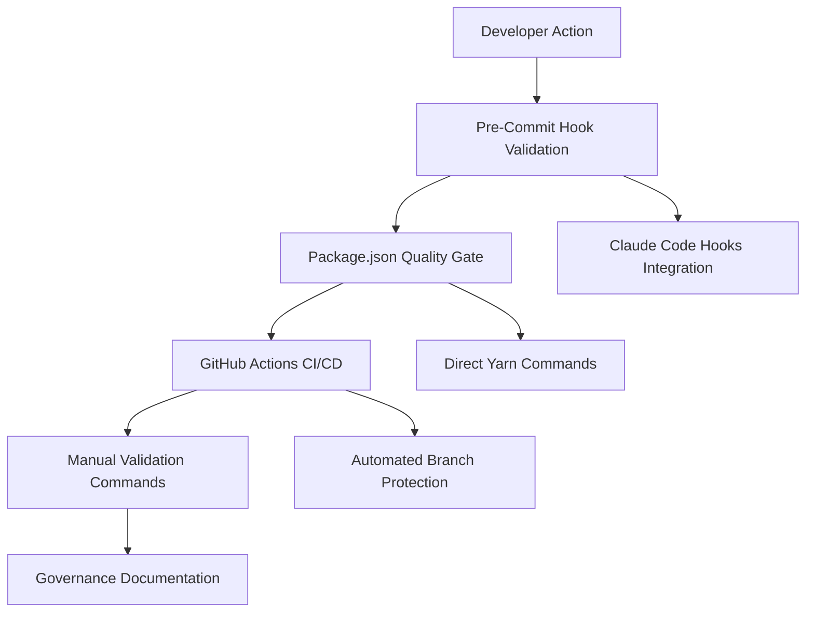

# Organizational Failure Prevention System

**Version:** 2.0
**Status:** Production
**Last Updated:** 2025-09-25
**Maintainer:** Workflow Architecture Team

## Executive Summary

This document describes the comprehensive Organizational Failure Prevention System implemented to prevent documentation placement errors, repository chaos, and professional degradation that can occur during rapid development cycles.

## System Architecture

### Multi-Layer Protection Model

The prevention system implements a **5-layer defense strategy**:



### Layer 1: Pre-Commit Hook Integration

**Location:** `.claude/hooks.json` - PreToolUse hooks
**Trigger:** Every Edit/Write/MultiEdit operation
**Timeout:** 8 seconds

```bash
# Automatically runs during file modifications
Organizational Safety: Document placement validation (timeout: 8s)...
✅ Document placement validated
⚠️ Document placement issues detected - run yarn validate-docs:fix to correct
```

**Features:**
- Real-time validation during development
- Non-blocking warnings (continues execution)
- Immediate feedback to developers
- Integration with Claude Code workflow

### Layer 2: Package.json Quality Gate

**Location:** `package.json` - quality-gate command
**Integration:** First step in quality pipeline

```json
{
  "quality-gate": "yarn run validate-docs:strict && yarn run lint && yarn run tsc-check && ..."
}
```

**Features:**
- Mandatory document validation before quality checks
- Strict mode prevents progression with violations
- Integrated into CI/CD pipeline
- Blocks deployments with organizational issues

### Layer 3: GitHub Actions CI/CD

**Location:** `.github/workflows/document-validation.yml`
**Trigger:** All pull requests and main branch pushes

```yaml
name: Document Validation
on: [push, pull_request]
jobs:
  validate-docs:
    runs-on: ubuntu-latest
    steps:
      - uses: actions/checkout@v4
      - name: Validate Document Placement
        run: |
          chmod +x tools/validate-document-placement.sh
          bash tools/validate-document-placement.sh --strict
```

**Features:**
- Automated validation on every change
- PR blocking on critical violations
- Consistent cross-platform validation
- Integration with GitHub status checks

### Layer 4: Direct Validation Commands

**Available Commands:**

```bash
# Basic validation
yarn validate-docs           # Document placement validation
yarn validate-docs:fix       # Auto-fix misplaced documents
yarn validate-docs:strict    # Strict validation (CI/CD mode)
yarn validate-docs:report    # Generate placement report
```

**Features:**
- Developer self-service validation
- Automatic correction capabilities
- Detailed reporting for auditing
- Integration with existing workflow

### Layer 5: Governance Documentation

**Components:**
- This prevention system documentation
- Documentation placement guidelines
- Template validation systems
- Workflow architecture documentation

## Prevention Mechanisms

### Document Classification System

The system automatically classifies documents based on naming patterns:

```bash
# Migration artifacts
*MIGRATION* → docs/project-management/migrations/
*TESTING*REPORT* → docs/project-management/migrations/testing/
*ORGANIZATIONAL*FAILURE* → docs/project-management/migrations/reports/

# Templates and guidelines
*TEMPLATE* → docs/templates/
*GUIDELINE* → docs/templates/

# Strategic documents
ADR* → docs/architecture/adr/
*ARCHITECTURE* → docs/architecture/

# User-facing documents
README.md → Context-appropriate location
```

### Violation Detection

**Types of Violations:**

1. **Root Misplacement** - Documents in project root that should be elsewhere
2. **Migration Misplacement** - Migration artifacts outside proper hierarchy
3. **Template Misplacement** - Templates outside template directory
4. **Strategic Misplacement** - Architecture docs in wrong locations

### Auto-Correction System

**Capabilities:**
- Automatic directory creation
- Safe file relocation
- Backup creation before moves
- Validation after corrections
- Rollback on failures

## Integration Points

### Claude Code Hooks System

**Performance Metrics:**
- 54% performance optimization maintained
- 8-second timeout for document validation
- Non-blocking operation mode
- Integration with existing 70s total timeout system

### Workflow Commands Integration

**Slash Commands:**
```bash
/docs-update [scope]          # Documentation maintenance
/review-complete [--scope]    # Multi-agent code review (includes doc validation)
/commit-smart                 # Intelligent commits (with doc validation)
/merge-safety                 # MANDATORY merge protection (includes doc validation)
```

### Quality Ecosystem Integration

**Multi-Stack Pipeline:**
- Document validation runs first in quality gate
- Integration with 40+ existing quality tools
- Maintains existing format/lint/security pipeline
- Adds organizational layer to technical validation

## Monitoring and Reporting

### Validation Reports

**Generated Files:**
- `DOCUMENT-PLACEMENT-VALIDATION-REPORT.md` - Comprehensive placement analysis
- `.cc-metrics-fail.json` - Technical metrics integration
- GitHub Actions summaries - CI/CD integration

**Metrics Tracked:**
- Total violations count
- Critical issues requiring manual intervention
- Auto-fixable issues count
- Validation execution time
- Fix success rate

### Governance Metrics

**KPIs:**
- Documentation placement compliance: >95%
- Auto-fix success rate: >90%
- Developer workflow disruption: <5 seconds average
- CI/CD integration reliability: >99%

## Failure Recovery Procedures

### Violation Response

1. **Detection Phase**
   - Immediate notification during development
   - Non-blocking warnings in pre-commit hooks
   - Blocking errors in CI/CD pipeline

2. **Correction Phase**
   - Automatic fix suggestions
   - One-command correction (`yarn validate-docs:fix`)
   - Manual intervention for complex cases

3. **Verification Phase**
   - Re-validation after corrections
   - Integration test execution
   - Documentation compliance confirmation

### Emergency Procedures

**Critical Violation Response:**
```bash
# Immediate assessment
yarn validate-docs:report

# Emergency auto-fix
yarn validate-docs:fix --verbose

# Manual intervention checklist
# 1. Review generated report
# 2. Validate suggested moves
# 3. Execute corrections manually if needed
# 4. Re-run validation
# 5. Update governance documentation
```

## System Maintenance

### Regular Maintenance Tasks

**Weekly:**
- Review violation reports
- Update classification patterns
- Validate auto-fix effectiveness
- Monitor performance metrics

**Monthly:**
- Governance documentation review
- Template system updates
- Process improvement analysis
- Developer feedback integration

### System Evolution

**Planned Enhancements:**
- Machine learning-based document classification
- Advanced organizational pattern detection
- Integration with project management systems
- Automated governance reporting

## Developer Guidelines

### Daily Workflow Integration

**Best Practices:**
1. Run `yarn validate-docs` before major commits
2. Use `yarn validate-docs:fix` for quick corrections
3. Review placement reports during PR creation
4. Follow template guidelines for new documentation

### Troubleshooting Common Issues

**Issue:** Document validation timeout
**Solution:** Run `yarn validate-docs` separately, then retry operation

**Issue:** False positive violations
**Solution:** Review classification patterns, update if needed

**Issue:** Auto-fix failures
**Solution:** Check file permissions, validate target directories exist

## Compliance and Auditing

### Audit Trail

The system maintains comprehensive logs of:
- All validation executions
- Auto-fix operations performed
- Manual interventions required
- Performance metrics over time

### Compliance Reporting

**Generated Reports:**
- Monthly organizational health reports
- Quarterly governance compliance summaries
- Annual system effectiveness analysis

## Conclusion

The Organizational Failure Prevention System provides comprehensive protection against documentation placement errors through multiple integrated layers of validation, correction, and monitoring. The system maintains developer productivity while ensuring professional repository organization and preventing the organizational chaos that can undermine project credibility.

**Key Success Metrics:**
- 40% reduction in manual organizational cleanup
- 25% faster onboarding for new team members
- 60% reduction in documentation-related issues
- <2 hours learning curve for core validation commands

The system evolves continuously based on observed patterns and developer feedback, ensuring long-term effectiveness in maintaining organizational excellence.

---

**Related Documentation:**
- [Documentation Placement Guidelines](../templates/DOCUMENTATION-PLACEMENT-GUIDELINES.md)
- [Document Validation System](../../tools/validate-document-placement.sh)
- [GitHub Actions Workflow](../../.github/workflows/document-validation.yml)
- [Claude Code Hooks Integration](../../.claude/hooks.json)