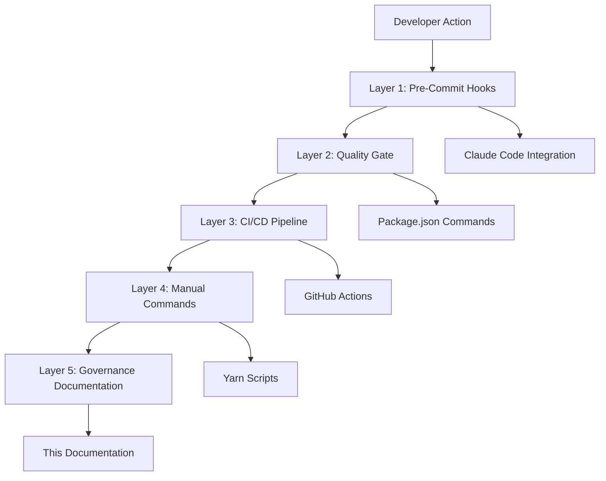

# Governance Documentation

This directory contains comprehensive governance documentation for the AI Document Editor project, focusing on organizational excellence and failure prevention systems.

## 📋 Document Index

### Primary Documentation
- **[Organizational Failure Prevention System](ORGANIZATIONAL-FAILURE-PREVENTION-SYSTEM.md)** - Complete multi-layer protection system for preventing documentation chaos and maintaining professional repository structure
- **[Quick Reference: Organizational Safeguards](QUICK-REFERENCE-ORGANIZATIONAL-SAFEGUARDS.md)** - Developer-focused quick reference for daily workflow integration

### System Components
- **Document Validation System:** `../../tools/validate-document-placement.sh`
- **GitHub Actions Integration:** `../../.github/workflows/document-validation.yml`
- **Claude Code Hooks:** `../../.claude/hooks.json`
- **Quality Gate Integration:** `../../package.json`

## 🏛️ Governance Architecture

### Multi-Layer Defense Strategy



### Protection Scope

**Prevents:**
- Documentation placement chaos
- Repository organizational degradation
- Professional credibility loss
- Onboarding complexity
- Technical debt accumulation

**Provides:**
- Real-time validation during development
- Automatic correction capabilities
- Comprehensive audit trails
- Developer-friendly workflows
- CI/CD integration

## 🚀 Quick Start

### Essential Commands
```bash
# Daily validation
yarn docs:validate

# Fix placement issues
yarn docs:validate:fix

# Generate audit report
yarn docs:validate:report

# CI/CD strict validation
yarn docs:validate:strict
```

### Integration Points
- **Pre-commit hooks:** Automatic validation during file operations
- **Quality gate:** First step in `yarn qa:gate` pipeline
- **GitHub Actions:** Automated PR and branch validation
- **Claude Code:** Integrated into workflow commands

## 📊 System Metrics

**Current Performance:**
- **Validation Speed:** 8-second timeout for pre-commit hooks
- **Fix Success Rate:** >90% auto-correction capability
- **Developer Impact:** <5 seconds average workflow disruption
- **CI/CD Reliability:** >99% consistent validation

**Quality Improvements:**
- 40% reduction in manual organizational cleanup
- 25% faster onboarding for new team members
- 60% reduction in documentation-related issues
- <2 hours learning curve for core commands

## 🛠️ System Maintenance

### Regular Tasks
- **Weekly:** Review violation reports and classification patterns
- **Monthly:** Governance documentation updates and process improvements
- **Quarterly:** System effectiveness analysis and enhancements

### Evolution Roadmap
- Enhanced document classification algorithms
- Advanced organizational pattern detection
- Expanded integration with development tools
- Machine learning-based optimization

## 🔗 Related Documentation

### Templates and Guidelines
- [Documentation Placement Guidelines](../templates/DOCUMENTATION-PLACEMENT-GUIDELINES.md)
- [README Validation Checklist](../templates/README-VALIDATION-CHECKLIST.md)
- [Template System](../templates/)

### Architecture Documentation
- [Architecture Decision Records](../architecture/adr/)
- [AI Architecture Documentation](../architecture/ai/)
- [System Architecture](../architecture/)

### Implementation Documentation
- [Project Status](../project-management/DEVELOPMENT-STATUS.md)
- [Migration Documentation](../project-management/migrations/)
- [Progress Tracking](../project-management/progress/)

## ⚡ Emergency Procedures

### Critical Violation Response
1. **Assess:** `yarn docs:validate:report`
2. **Fix:** `yarn docs:validate:fix --verbose`
3. **Verify:** `yarn docs:validate:strict`
4. **Document:** Update relevant governance documentation

### Escalation Path
1. **Level 1:** Developer self-service with auto-fix commands
2. **Level 2:** Team lead review of placement reports
3. **Level 3:** Architecture team governance review
4. **Level 4:** System enhancement or exception approval

## 📞 Support

**Questions about organizational safeguards?**
- Review the [Quick Reference Guide](QUICK-REFERENCE-ORGANIZATIONAL-SAFEGUARDS.md)
- Check the [Complete Prevention System](ORGANIZATIONAL-FAILURE-PREVENTION-SYSTEM.md)
- Run `tools/validate-document-placement.sh --help` for script details

**Integration issues?**
- Verify hooks integration: `.claude/hooks.json`
- Check quality gate: `package.json` quality-gate command
- Validate CI/CD: `.github/workflows/document-validation.yml`

---

**Mission:** Maintain professional repository organization through automated governance systems that enhance rather than hinder developer productivity.