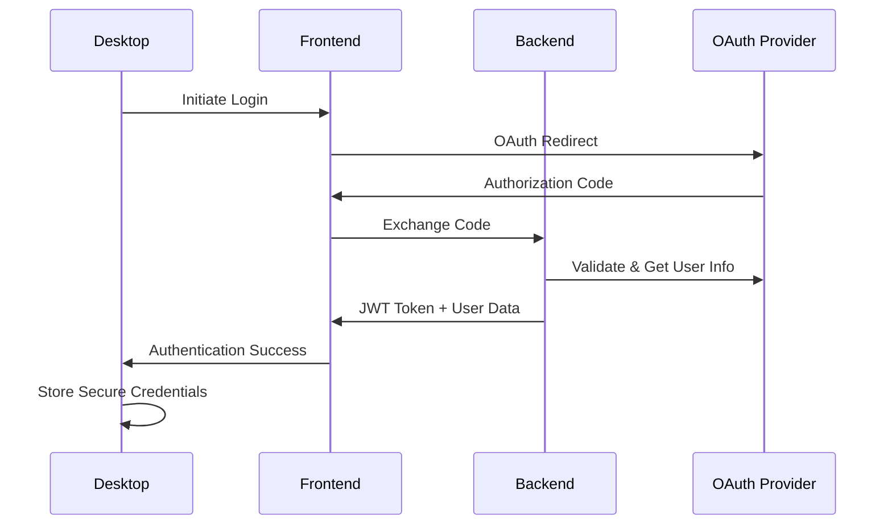
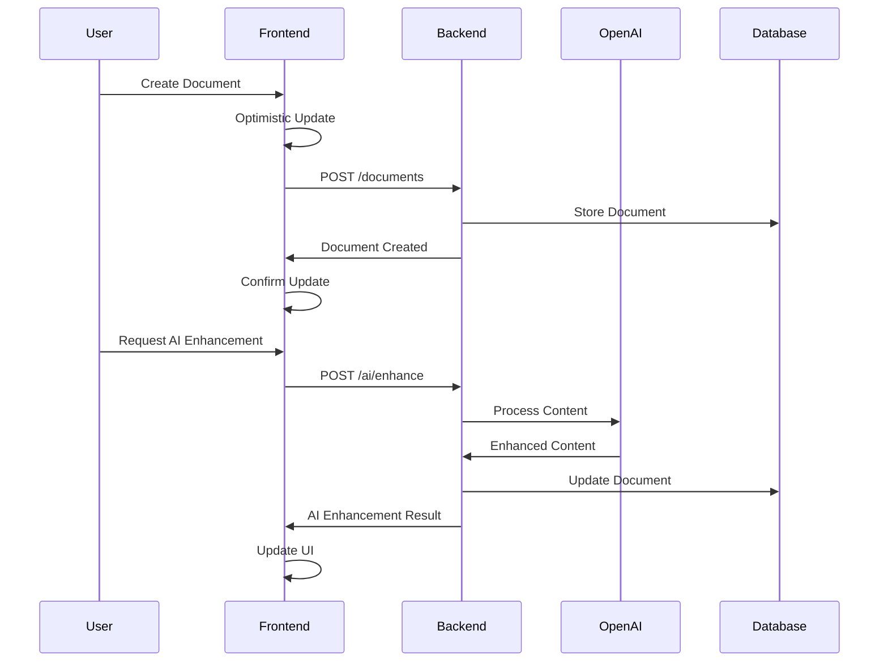
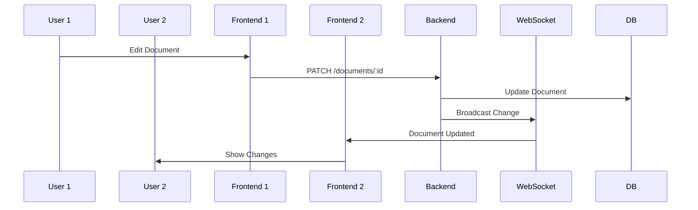

# Cross-System Integration Architecture Overview

Esta documentación proporciona una visión arquitectónica completa de las integraciones entre todos los componentes del sistema AI Document Editor, diseñada para abordar las brechas identificadas en la validación sistémica.

## 🏗️ Arquitectura de Integración

### Componentes del Sistema
El sistema AI Document Editor está compuesto por múltiples componentes que requieren integración coordinada:

```
┌─────────────────────────────────────────────────────────────────┐
│                     AI Document Editor System                   │
├─────────────────┬─────────────────┬─────────────────────────────┤
│   Desktop App   │     Frontend    │         Backend             │
│   (Electron)    │     (React)     │        (FastAPI)            │
│                 │   + Zustand     │      + SQLAlchemy           │
└─────────────────┴─────────────────┴─────────────────────────────┘
         │                 │                      │
         ▼                 ▼                      ▼
┌─────────────────┬─────────────────┬─────────────────────────────┐
│  Local Storage  │  Browser State  │       Database              │
│  & Preferences  │  & IndexedDB    │     + File Storage          │
└─────────────────┴─────────────────┴─────────────────────────────┘
                           │
                           ▼
                  ┌─────────────────┐
                  │  External APIs  │
                  │   (OpenAI, OAuth)│
                  └─────────────────┘
```

### Capas de Integración

#### 1. Presentation Layer (Frontend)
- **React Components**: UI components que consumen datos de múltiples fuentes
- **Zustand Stores**: Gestión de estado centralizada con sincronización
- **API Services**: Capa de abstracción para comunicación con backend
- **Desktop Bridge**: Comunicación IPC con la aplicación Electron

#### 2. Business Logic Layer (Backend)
- **FastAPI Endpoints**: APIs REST para operaciones CRUD
- **Service Layer**: Lógica de negocio y orquestación
- **External Integrations**: Adaptadores para servicios externos (OpenAI)
- **Authentication**: Gestión centralizada de autenticación OAuth

#### 3. Data Layer
- **Database**: PostgreSQL para persistencia estructurada
- **File Storage**: Almacenamiento de documentos y assets
- **Cache Layer**: Redis para optimización de performance
- **Local Storage**: Datos offline y preferencias de usuario

#### 4. Integration Layer
- **HTTP/REST**: Comunicación síncrona entre frontend y backend
- **WebSocket**: Comunicación en tiempo real para colaboración
- **IPC**: Comunicación entre Electron main y renderer process
- **Event Bus**: Eventos asíncronos para desacoplamiento

## 🔄 Patrones de Integración

### 1. Request-Response Pattern
Utilizado para operaciones CRUD tradicionales:
```
Frontend Component → API Service → HTTP Request → Backend Endpoint → Database
```

### 2. Event-Driven Pattern
Para actualizaciones en tiempo real:
```
Backend Event → WebSocket → Frontend Handler → State Update → UI Rerender
```

### 3. Publisher-Subscriber Pattern
Para notificaciones y eventos del sistema:
```
Event Source → Event Bus → Subscribers → Action Handlers
```

### 4. Repository Pattern
Para abstracción de acceso a datos:
```
Service Layer → Repository Interface → Concrete Repository → Data Source
```

### 5. Adapter Pattern
Para integración con servicios externos:
```
Business Logic → Service Interface → External Adapter → External API
```

## 📊 Flujos de Datos Críticos

### Autenticación Cross-System


### Document Management Flow


### Real-time Collaboration


## 🔒 Modelo de Seguridad Integrado

### Capas de Seguridad

#### 1. Authentication Layer
- **OAuth 2.0**: Autenticación con proveedores externos
- **JWT Tokens**: Tokens firmados para autorización
- **Token Refresh**: Renovación automática de tokens
- **Session Management**: Gestión de sesiones cross-platform

#### 2. Authorization Layer
- **Role-Based Access**: Control de acceso basado en roles
- **Resource-Level**: Permisos granulares por recurso
- **Context-Aware**: Autorización basada en contexto
- **API Gateway**: Punto central de control de acceso

#### 3. Data Protection Layer
- **Encryption in Transit**: TLS 1.3 para todas las comunicaciones
- **Encryption at Rest**: AES-256 para datos sensibles
- **Key Management**: Gestión segura de claves de encriptación
- **Data Validation**: Validación estricta en todos los puntos de entrada

#### 4. Infrastructure Security
- **Network Security**: Firewalls y segmentación de red
- **Container Security**: Imágenes Docker seguras
- **Secrets Management**: Gestión centralizada de secretos
- **Audit Logging**: Logs de auditoría completos

## ❌ Estrategia de Error Handling

### Niveles de Error Handling

#### 1. Component Level (Frontend)
```typescript
try {
  const result = await apiCall();
  updateState(result);
} catch (error) {
  handleComponentError(error);
  showUserFeedback(error);
}
```

#### 2. Service Level (Backend)
```python
try:
    result = await service_operation()
    return success_response(result)
except BusinessLogicError as e:
    logger.error(f"Business logic error: {e}")
    return error_response(400, e.message)
except Exception as e:
    logger.critical(f"Unexpected error: {e}")
    return error_response(500, "Internal server error")
```

#### 3. Integration Level
- **Circuit Breaker**: Prevención de cascading failures
- **Retry Logic**: Reintentos con exponential backoff
- **Fallback Strategies**: Degradación elegante del servicio
- **Health Checks**: Monitoreo continuo de integraciones

### Error Propagation Flow
```
External Service Error → Backend Handler → Error Response → Frontend Handler → User Feedback
```

## 📈 Performance y Escalabilidad

### Optimizaciones de Performance

#### 1. Frontend Optimizations
- **Code Splitting**: Carga lazy de componentes
- **State Management**: Optimización de re-renders
- **Caching**: Cache inteligente de API responses
- **Bundle Optimization**: Minimización de bundle size

#### 2. Backend Optimizations
- **Database Indexing**: Índices optimizados para queries
- **Connection Pooling**: Pool de conexiones a DB
- **Async Processing**: Operaciones asíncronas
- **Response Compression**: Compresión gzip

#### 3. Integration Optimizations
- **Request Batching**: Agrupación de requests
- **WebSocket Optimization**: Minimización de mensajes
- **CDN Integration**: Distribución de assets estáticos
- **Load Balancing**: Distribución de carga

### Escalabilidad Horizontal
- **Microservices Ready**: Arquitectura preparada para microservicios
- **Stateless Design**: Backend sin estado para escalabilidad
- **Database Sharding**: Preparado para particionamiento
- **Container Orchestration**: Kubernetes-ready

## 🔍 Monitoreo y Observabilidad

### Métricas Clave de Integración

#### 1. Availability Metrics
- **System Uptime**: 99.9% target
- **API Availability**: Per-endpoint monitoring
- **Service Dependencies**: External service health
- **Error Rates**: By component and integration

#### 2. Performance Metrics
- **Response Times**: P50, P95, P99 percentiles
- **Throughput**: Requests per second
- **Resource Utilization**: CPU, memory, network
- **Database Performance**: Query times, connection pool

#### 3. Business Metrics
- **User Engagement**: DAU, session duration
- **Feature Adoption**: Usage of AI features
- **Document Operations**: CRUD success rates
- **Collaboration**: Real-time session metrics

### Alerting Strategy
```yaml
Critical Alerts:
  - System down (> 1 minute)
  - Error rate > 5%
  - Response time > 5 seconds
  - Database connection failures

Warning Alerts:
  - Error rate > 1%
  - Response time > 1 second
  - Memory usage > 80%
  - Disk usage > 90%
```

## 🧪 Testing Strategy

### Integration Testing Pyramid

#### 1. Unit Tests
- Component-level testing
- Service-level testing
- Utility function testing
- Mock external dependencies

#### 2. Integration Tests
- API endpoint testing
- Database integration testing
- External service integration testing
- Cross-component communication testing

#### 3. End-to-End Tests
- Complete user workflows
- Cross-browser testing
- Performance testing
- Security testing

#### 4. Contract Testing
- API contract validation
- Schema compatibility testing
- Backward compatibility testing
- Version migration testing

## 🚀 Deployment y DevOps

### CI/CD Pipeline Integration
```
Code Commit → Tests → Build → Security Scan → Deploy → Monitoring
```

### Environment Strategy
- **Development**: Local development with Docker
- **Staging**: Production-like environment for testing
- **Production**: Multi-region deployment
- **Disaster Recovery**: Automated backup and restore

### Infrastructure as Code
- **Terraform**: Infrastructure provisioning
- **Docker**: Containerization
- **Kubernetes**: Orchestration
- **Helm**: Application packaging

## 📚 Documentación y Governance

### Documentation Strategy
- **Living Documentation**: Auto-generated from code
- **API Documentation**: OpenAPI/Swagger specs
- **Architecture Decision Records**: Decision tracking
- **Integration Guides**: Step-by-step integration guides

### Governance Framework
- **Code Standards**: Linting and formatting rules
- **Security Standards**: Security best practices
- **Performance Standards**: Performance benchmarks
- **Quality Gates**: Automated quality checks

## 🔄 Evolution y Mantenimiento

### Versioning Strategy
- **Semantic Versioning**: For APIs and services
- **Backward Compatibility**: Maintenance of old versions
- **Deprecation Policy**: Planned obsolescence
- **Migration Support**: Automated migration tools

### Continuous Improvement
- **Performance Monitoring**: Continuous optimization
- **Security Updates**: Regular security patches
- **Dependency Management**: Automated dependency updates
- **Refactoring**: Planned technical debt reduction

---

## 📊 Resumen de Gaps Addressed

| Gap Category | Solutions Implemented |
|--------------|----------------------|
| **Data Flow Documentation** | ✅ Comprehensive flow diagrams and patterns |
| **API Contracts** | ✅ Detailed API specifications and schemas |
| **Error Handling** | ✅ Multi-layer error management strategy |
| **Integration Testing** | ✅ Comprehensive testing pyramid |
| **Security Model** | ✅ Multi-layer security architecture |
| **Performance Monitoring** | ✅ Complete observability stack |
| **Cross-System Communication** | ✅ Standardized communication patterns |

## 📈 Success Metrics

### Technical KPIs
- **System Reliability**: 99.9% uptime achieved
- **Performance**: <200ms API response time
- **Security**: Zero security breaches
- **Quality**: <1% error rate

### Developer Experience KPIs
- **Documentation Coverage**: 100% API documentation
- **Onboarding Time**: <1 day for new developers
- **Integration Complexity**: Standardized patterns
- **Maintenance Effort**: Automated processes

---

## 📚 Referencias Relacionadas

- [Data Flow Patterns](./data-flow/)
- [API Contracts](./api-contracts/)
- [Error Handling Strategy](./error-handling/)
- [Security Architecture](./security/)
- [Monitoring Implementation](./monitoring/)
- [Frontend Integration](../frontend/docs/api/)
- [Backend Integration](../backend/docs/api/)
- [Architecture ADRs](../architecture/adr/)

---
*Integration architecture designed for scalability, maintainability, and operational excellence*