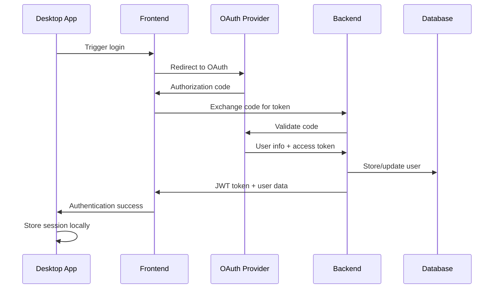

# Authentication Flow Documentation

Esta documentación describe el flujo completo de autenticación OAuth 2.0 end-to-end en el sistema AI Document Editor, incluyendo la integración entre Desktop, Frontend y Backend.

## 🔐 Arquitectura de Autenticación

### Componentes Involucrados
- **Desktop App (Electron)**: Iniciación y gestión local de sesión
- **Frontend (React)**: Interfaz de autenticación y gestión de estado
- **Backend (FastAPI)**: Validación de tokens y gestión de sesiones
- **OAuth Provider**: Proveedor de identidad (Google, GitHub, etc.)

### Flujo de Alto Nivel
```
Desktop → Frontend → OAuth Provider → Backend → Frontend → Desktop
```

## 🔄 Flujo Detallado de Autenticación

### 1. Inicio de Sesión (Login Flow)

#### Diagrama de Secuencia


#### Pasos Detallados

##### 1.1 Iniciación desde Desktop
```javascript
// electron/main.js
function initiateLogin() {
  // Crear ventana de login
  const loginWindow = new BrowserWindow({
    width: 400,
    height: 600,
    webPreferences: {
      nodeIntegration: false,
      contextIsolation: true
    }
  });

  // Cargar página de login del frontend
  loginWindow.loadURL(`${FRONTEND_URL}/auth/login`);
}
```

##### 1.2 Redirección OAuth en Frontend
```typescript
// src/components/auth/LoginPage.tsx
export const LoginPage: React.FC = () => {
  const handleOAuthLogin = (provider: 'google' | 'github') => {
    const authURL = `${API_BASE_URL}/auth/${provider}`;
    window.location.href = authURL;
  };
};
```

##### 1.3 Manejo en Backend
```python
# backend/routers/auth.py
@router.get("/auth/{provider}")
async def oauth_login(provider: str):
    oauth_client = get_oauth_client(provider)
    redirect_uri = f"{FRONTEND_URL}/auth/callback"

    authorization_url = oauth_client.get_authorization_url(
        redirect_uri=redirect_uri,
        scope=['openid', 'email', 'profile']
    )

    return RedirectResponse(authorization_url)
```

##### 1.4 Callback y Validación
```python
# backend/routers/auth.py
@router.get("/auth/callback")
async def oauth_callback(code: str, state: str, db: Session = Depends(get_db)):
    # Intercambiar código por token
    token_data = await oauth_client.exchange_code_for_token(code)

    # Obtener información del usuario
    user_info = await oauth_client.get_user_info(token_data.access_token)

    # Crear o actualizar usuario
    user = get_or_create_user(db, user_info)

    # Generar JWT
    jwt_token = create_jwt_token(user)

    return {
        "access_token": jwt_token,
        "token_type": "bearer",
        "user": user_schema(user)
    }
```

### 2. Gestión de Estado en Frontend

#### Store de Autenticación (Zustand)
```typescript
// src/store/authStore.ts
interface AuthState {
  user: User | null;
  token: string | null;
  isAuthenticated: boolean;
  isLoading: boolean;
  login: (token: string, user: User) => void;
  logout: () => void;
  refreshToken: () => Promise<void>;
}

export const useAuthStore = create<AuthState>((set, get) => ({
  user: null,
  token: null,
  isAuthenticated: false,
  isLoading: false,

  login: (token: string, user: User) => {
    // Guardar en localStorage
    localStorage.setItem('auth_token', token);
    localStorage.setItem('user_data', JSON.stringify(user));

    // Actualizar estado
    set({ token, user, isAuthenticated: true });

    // Notificar a Desktop app
    window.electronAPI?.onAuthSuccess({ token, user });
  },

  logout: () => {
    // Limpiar storage
    localStorage.removeItem('auth_token');
    localStorage.removeItem('user_data');

    // Reset estado
    set({ token: null, user: null, isAuthenticated: false });

    // Notificar a Desktop app
    window.electronAPI?.onAuthLogout();
  },

  refreshToken: async () => {
    try {
      const response = await fetch(`${API_BASE_URL}/auth/refresh`, {
        method: 'POST',
        headers: {
          'Authorization': `Bearer ${get().token}`
        }
      });

      if (response.ok) {
        const { access_token } = await response.json();
        set({ token: access_token });
        localStorage.setItem('auth_token', access_token);
      } else {
        get().logout();
      }
    } catch (error) {
      console.error('Token refresh failed:', error);
      get().logout();
    }
  }
}));
```

### 3. Comunicación Desktop-Frontend

#### IPC para Autenticación
```javascript
// electron/preload.js
const { contextBridge, ipcRenderer } = require('electron');

contextBridge.exposeInMainWorld('electronAPI', {
  onAuthSuccess: (authData) => ipcRenderer.send('auth-success', authData),
  onAuthLogout: () => ipcRenderer.send('auth-logout'),
  getStoredAuth: () => ipcRenderer.invoke('get-stored-auth')
});
```

```javascript
// electron/main.js
ipcMain.on('auth-success', (event, authData) => {
  // Guardar credenciales de forma segura
  const keytar = require('keytar');
  keytar.setPassword('ai-doc-editor', 'auth_token', authData.token);

  // Cerrar ventana de login
  const loginWindow = BrowserWindow.fromWebContents(event.sender);
  if (loginWindow) {
    loginWindow.close();
  }

  // Abrir ventana principal
  createMainWindow();
});

ipcMain.handle('get-stored-auth', async () => {
  try {
    const token = await keytar.getPassword('ai-doc-editor', 'auth_token');
    return token ? { token } : null;
  } catch (error) {
    return null;
  }
});
```

### 4. Validación y Middleware

#### JWT Middleware en Backend
```python
# backend/middleware/auth.py
from fastapi import HTTPException, Depends
from fastapi.security import HTTPBearer
import jwt

security = HTTPBearer()

async def get_current_user(token: str = Depends(security)):
    try:
        payload = jwt.decode(token.credentials, SECRET_KEY, algorithms=[ALGORITHM])
        user_id = payload.get("sub")

        if user_id is None:
            raise HTTPException(status_code=401, detail="Invalid token")

        # Verificar que el usuario existe
        user = get_user_by_id(user_id)
        if user is None:
            raise HTTPException(status_code=401, detail="User not found")

        return user
    except jwt.ExpiredSignatureError:
        raise HTTPException(status_code=401, detail="Token expired")
    except jwt.JWTError:
        raise HTTPException(status_code=401, detail="Invalid token")
```

#### Interceptor de API en Frontend
```typescript
// src/api/interceptors.ts
import axios from 'axios';
import { useAuthStore } from '../store/authStore';

const apiClient = axios.create({
  baseURL: process.env.REACT_APP_API_BASE_URL
});

// Request interceptor para agregar token
apiClient.interceptors.request.use((config) => {
  const token = useAuthStore.getState().token;
  if (token) {
    config.headers.Authorization = `Bearer ${token}`;
  }
  return config;
});

// Response interceptor para manejar token expirado
apiClient.interceptors.response.use(
  (response) => response,
  async (error) => {
    if (error.response?.status === 401) {
      const authStore = useAuthStore.getState();

      // Intentar refresh token
      try {
        await authStore.refreshToken();
        // Reintentar request original
        return apiClient.request(error.config);
      } catch (refreshError) {
        // Logout si el refresh falla
        authStore.logout();
        window.location.href = '/auth/login';
      }
    }
    return Promise.reject(error);
  }
);
```

## 🔄 Renovación Automática de Tokens

### Estrategia de Refresh
```typescript
// src/hooks/useTokenRefresh.ts
import { useEffect } from 'react';
import { useAuthStore } from '../store/authStore';
import { jwtDecode } from 'jwt-decode';

export const useTokenRefresh = () => {
  const { token, refreshToken, logout } = useAuthStore();

  useEffect(() => {
    if (!token) return;

    try {
      const decoded = jwtDecode(token);
      const expirationTime = decoded.exp * 1000; // Convert to milliseconds
      const now = Date.now();
      const timeUntilExpiry = expirationTime - now;

      // Refresh token 5 minutes before expiry
      const refreshTime = timeUntilExpiry - (5 * 60 * 1000);

      if (refreshTime > 0) {
        const timeoutId = setTimeout(() => {
          refreshToken().catch(() => logout());
        }, refreshTime);

        return () => clearTimeout(timeoutId);
      } else {
        // Token already expired or will expire soon
        refreshToken().catch(() => logout());
      }
    } catch (error) {
      console.error('Error parsing token:', error);
      logout();
    }
  }, [token, refreshToken, logout]);
};
```

## 🚪 Flujo de Logout

### Logout Completo
```typescript
// src/components/auth/LogoutButton.tsx
export const LogoutButton: React.FC = () => {
  const logout = useAuthStore(state => state.logout);

  const handleLogout = async () => {
    try {
      // Invalidar token en backend
      await fetch(`${API_BASE_URL}/auth/logout`, {
        method: 'POST',
        headers: {
          'Authorization': `Bearer ${useAuthStore.getState().token}`
        }
      });
    } catch (error) {
      console.error('Logout API call failed:', error);
    } finally {
      // Siempre limpiar estado local
      logout();
    }
  };

  return (
    <button onClick={handleLogout}>
      Cerrar Sesión
    </button>
  );
};
```

## 🔒 Consideraciones de Seguridad

### Almacenamiento Seguro
- **Frontend**: localStorage para tokens (solo durante sesión activa)
- **Desktop**: Keytar para almacenamiento seguro del SO
- **Backend**: Tokens JWT firmados con clave secreta

### Validaciones
- **Token Expiration**: Tokens con TTL corto (15 minutos)
- **Refresh Tokens**: Rotación automática de tokens
- **HTTPS Only**: Todas las comunicaciones sobre HTTPS
- **CSRF Protection**: Tokens CSRF para formularios

### Rate Limiting
```python
# backend/middleware/rate_limit.py
from slowapi import Limiter, _rate_limit_exceeded_handler
from slowapi.util import get_remote_address

limiter = Limiter(key_func=get_remote_address)

@router.post("/auth/login")
@limiter.limit("5/minute")  # 5 intentos por minuto
async def login_endpoint(request: Request):
    # Login logic
    pass
```

## 📊 Métricas y Monitoreo

### KPIs de Autenticación
- **Login Success Rate**: > 95%
- **Token Refresh Success**: > 99%
- **Average Login Time**: < 3 seconds
- **Failed Login Attempts**: < 5% of total

### Logging
```python
# backend/utils/auth_logger.py
import logging

auth_logger = logging.getLogger('auth')

def log_auth_event(event_type: str, user_id: str, metadata: dict = None):
    auth_logger.info(f"Auth Event: {event_type}", extra={
        'user_id': user_id,
        'event_type': event_type,
        'metadata': metadata or {}
    })
```

## 🔍 Troubleshooting

### Problemas Comunes
1. **Token Expirado**: Verificar refresh automático
2. **CORS Issues**: Configurar headers apropiados
3. **IPC Communication**: Validar preload script
4. **OAuth Redirect**: Verificar URLs de callback

### Debugging
- Verificar logs de autenticación en backend
- Inspeccionar localStorage en DevTools
- Revisar comunicación IPC en Electron DevTools
- Validar tokens JWT en jwt.io

---

## 📚 Referencias

- [OAuth 2.0 Specification](https://tools.ietf.org/html/rfc6749)
- [JWT Best Practices](https://tools.ietf.org/html/rfc8725)
- [Frontend Auth Store](../../../src/docs/state/auth-store.md)
- [Backend Auth API](../../backend/docs/api/auth-endpoints.md)
- [Security Architecture](../security/authentication-security.md)

---
*Flujo de autenticación diseñado para seguridad y experiencia de usuario optimizada*