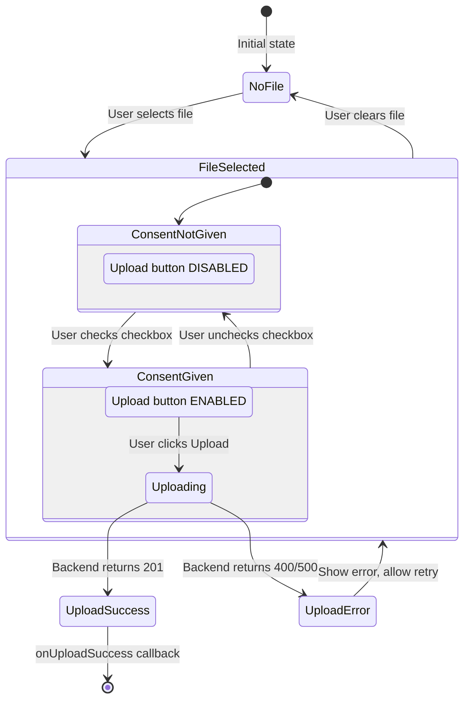

# Consent Checkbox Component

**Task:** T-24 - Consent Management (Frontend)
**Status:** ✅ Completed (2025-10-24)
**Purpose:** User consent UI for AI document processing

---

## Overview

The Consent Checkbox component provides a required user interface element for obtaining explicit consent before uploading documents to AI services. This implementation ensures GDPR compliance and integrates seamlessly with the upload workflow.

### Key Features

- ✅ **Explicit Consent UI**: Clear checkbox with consent text
- ✅ **Upload Blocking**: Button disabled until consent given
- ✅ **State Management**: React state synced with upload hook
- ✅ **Error Handling**: Frontend validation before API call
- ✅ **Backend Integration**: Consent passed as form data to `/api/upload`

---

## Component Architecture

### File Structure

```
src/pages/Documents/
├── components/
│   ├── UploadForm.tsx          # ← Main upload form with consent checkbox
│   ├── DropZone.tsx            # Drag & drop area
│   └── FilePreview.tsx         # File preview with progress
├── hooks/
│   ├── useFileUpload.ts        # ← Upload logic with consent validation
│   └── useFileUpload.helpers.ts # Upload helpers
└── Documents.tsx               # Document library page
```

### Component Hierarchy

```
Documents.tsx
  └─ UploadForm.tsx ← Renders consent checkbox
      ├─ DropZone.tsx
      ├─ FilePreview.tsx
      └─ useFileUpload() ← Validates consent + uploads file
```

---

## Implementation

### UploadForm.tsx (Parent Component)

```typescript
/**
 * Upload Form Component
 * T-49-ST2: File upload with drag & drop, validation, progress
 * T-24-ST1: Consent checkbox for AI processing
 */
import React, { useState } from 'react';
import { useFileUpload } from '../hooks/useFileUpload';
import DropZone from './DropZone';
import FilePreview from './FilePreview';

interface UploadFormProps {
  onUploadSuccess?: (documentId: string) => void;
  onUploadError?: (error: string) => void;
}

const UploadForm: React.FC<UploadFormProps> = ({ onUploadSuccess, onUploadError }) => {
  // State: Consent checkbox (controlled component)
  const [consentGiven, setConsentGiven] = useState(false);

  // Hook: File upload logic with consent validation
  const {
    isDragging,
    selectedFile,
    isUploading,
    uploadProgress,
    error,
    fileInputRef,
    handleDragEnter,
    handleDragLeave,
    handleDragOver,
    handleDrop,
    handleFileInputChange,
    handleUpload,
    handleBrowseClick,
    handleClearFile,
  } = useFileUpload({ onUploadSuccess, onUploadError, consentGiven });

  return (
    <div className="bg-white dark:bg-gray-800 rounded-lg shadow p-6">
      <h2 className="text-xl font-bold text-gray-900 dark:text-white mb-4">
        Upload Document
      </h2>

      {/* Drag & Drop Zone */}
      <DropZone
        isDragging={isDragging}
        onDragEnter={handleDragEnter}
        onDragLeave={handleDragLeave}
        onDragOver={handleDragOver}
        onDrop={handleDrop}
        onBrowseClick={handleBrowseClick}
      />

      {/* Hidden File Input */}
      <input
        ref={fileInputRef}
        type="file"
        accept=".pdf,.docx,.md"
        onChange={handleFileInputChange}
        className="hidden"
      />

      {/* Selected File Preview */}
      {selectedFile && (
        <FilePreview
          file={selectedFile}
          isUploading={isUploading}
          uploadProgress={uploadProgress}
          onClear={handleClearFile}
        />
      )}

      {/* Error Message */}
      {error && (
        <div className="mt-4 p-3 bg-red-100 dark:bg-red-900 border border-red-400 dark:border-red-700 text-red-700 dark:text-red-200 rounded">
          {error}
        </div>
      )}

      {/* ===== CONSENT CHECKBOX (T-24-ST1) ===== */}
      {selectedFile && (
        <div className="mt-4 mb-4">
          <label className="flex items-center gap-2 cursor-pointer">
            <input
              type="checkbox"
              checked={consentGiven}
              onChange={e => setConsentGiven(e.target.checked)}
              className="w-4 h-4 text-blue-600 border-gray-300 rounded focus:ring-blue-500 dark:border-gray-600 dark:focus:ring-blue-600 dark:ring-offset-gray-800"
            />
            <span className="text-sm text-gray-700 dark:text-gray-300">
              I consent to send this document to AI services for analysis and processing
            </span>
          </label>
        </div>
      )}

      {/* Upload Button (disabled if consent not given) */}
      <div className="mt-4 flex justify-end">
        <button
          onClick={handleUpload}
          disabled={!selectedFile || isUploading || !consentGiven}
          className="px-4 py-2 bg-blue-600 text-white rounded hover:bg-blue-700 disabled:opacity-50 disabled:cursor-not-allowed"
        >
          {isUploading ? 'Uploading...' : 'Upload'}
        </button>
      </div>
    </div>
  );
};

export default UploadForm;
```

**Key Elements:**

1. **State Management:**
   ```typescript
   const [consentGiven, setConsentGiven] = useState(false);
   ```
   - Controlled checkbox state
   - Passed to `useFileUpload` hook

2. **Conditional Rendering:**
   ```typescript
   {selectedFile && (
     <div className="mt-4 mb-4">
       {/* Consent checkbox only shown when file selected */}
     </div>
   )}
   ```

3. **Button Validation:**
   ```typescript
   disabled={!selectedFile || isUploading || !consentGiven}
   ```
   - Button disabled if no file, uploading, OR consent not given

---

### useFileUpload.ts (Upload Hook)

```typescript
/**
 * File Upload Hook
 * T-49-ST2: File upload logic and state management
 * T-24: Consent validation
 */
import { useState, useRef } from 'react';
import { useAuth } from '@hooks/useAuth';
import { validateFile, uploadWithRetry } from './useFileUpload.helpers';

interface UseFileUploadProps {
  onUploadSuccess?: (documentId: string) => void;
  onUploadError?: (error: string) => void;
  consentGiven?: boolean;  // ← Consent prop
}

/**
 * Validate upload preconditions (including consent)
 */
const validateUploadPreconditions = (
  file: File | null,
  token: string | null,
  consentGiven: boolean
): string | null => {
  if (!token) return 'Please login to upload files.';
  if (!file) return 'No file selected.';
  if (!consentGiven) {
    return 'You must provide consent to upload documents for AI processing.';
  }
  return null;
};

/**
 * Create upload handler with consent validation
 */
const createUploadHandler = (options: UploadHandlerOptions) => {
  return async () => {
    const { file, token, consentGiven, setIsUploading, setError, onError } = options;

    // Frontend validation: Check consent BEFORE upload
    const validationError = validateUploadPreconditions(file, token, consentGiven);
    if (validationError) {
      setError(validationError);
      onError(validationError);
      return;
    }

    setIsUploading(true);
    setError(null);

    try {
      // Upload file with consent metadata
      const data = await uploadWithRetry({
        file: file!,
        token: token!,
        refreshAccessToken,
        setProgress: setUploadProgress,
        consentGiven,  // ← Passed to backend
      });

      onSuccess(data.document_id);
    } catch (err: unknown) {
      const errorMsg = err instanceof Error ? err.message : 'Upload failed. Please try again.';
      setError(errorMsg);
      onError(errorMsg);
      setIsUploading(false);
    }
  };
};

export const useFileUpload = ({
  onUploadSuccess,
  onUploadError,
  consentGiven = false,  // ← Default: false (consent not given)
}: UseFileUploadProps) => {
  // ... state management ...

  const handleUpload = createUploadHandler({
    file: selectedFile,
    token,
    consentGiven,  // ← Consent validation
    setIsUploading,
    setError,
    onError: onUploadError,
    // ...
  });

  return {
    // ... all upload handlers ...
    handleUpload,
  };
};
```

**Validation Flow:**

```
User clicks "Upload"
  ↓
handleUpload()
  ↓
validateUploadPreconditions(file, token, consentGiven)
  ├─ No file? → Error: "No file selected"
  ├─ No token? → Error: "Please login"
  ├─ No consent? → Error: "You must provide consent"
  └─ All valid? → Call uploadWithRetry()
```

---

### useFileUpload.helpers.ts (Upload Helper)

```typescript
/**
 * Upload with retry logic and consent tracking
 */
interface UploadWithRetryOptions {
  file: File;
  token: string;
  refreshAccessToken: () => Promise<string | null>;
  setProgress: (progress: number) => void;
  consentGiven: boolean;  // ← Consent parameter
  maxRetries?: number;
}

export async function uploadWithRetry(options: UploadWithRetryOptions): Promise<any> {
  const { file, token, consentGiven, setProgress, maxRetries = 3 } = options;

  // Create FormData with file + consent
  const formData = new FormData();
  formData.append('file', file);
  formData.append('consent_given', consentGiven.toString());  // ← "true" or "false"

  let lastError: Error | null = null;

  for (let attempt = 1; attempt <= maxRetries; attempt++) {
    try {
      setProgress(10);

      const response = await fetch('/api/upload', {
        method: 'POST',
        headers: {
          Authorization: `Bearer ${token}`,
        },
        body: formData,
      });

      setProgress(50);

      if (!response.ok) {
        // Handle HTTP errors
        const errorData = await response.json();

        if (response.status === 400) {
          // Consent error (no retry)
          throw new Error(errorData.detail || 'Invalid request. Please check consent.');
        } else if (response.status === 401) {
          // Token expired, retry with refresh
          const newToken = await options.refreshAccessToken();
          if (!newToken) throw new Error('Session expired. Please login again.');
          // Retry with new token
          continue;
        } else {
          throw new Error(errorData.detail || 'Upload failed');
        }
      }

      setProgress(90);
      const data = await response.json();
      setProgress(100);

      return data;
    } catch (error) {
      lastError = error instanceof Error ? error : new Error('Unknown error');

      // No retry for validation errors (400)
      if (lastError.message.includes('consent')) {
        throw lastError;
      }

      // Retry for network/server errors
      if (attempt < maxRetries) {
        await new Promise(resolve => setTimeout(resolve, 1000 * attempt));
      }
    }
  }

  throw lastError || new Error('Upload failed after retries');
}
```

**FormData Structure:**

```http
POST /api/upload
Content-Type: multipart/form-data

------WebKitFormBoundary
Content-Disposition: form-data; name="file"; filename="document.pdf"
Content-Type: application/pdf

<binary content>
------WebKitFormBoundary
Content-Disposition: form-data; name="consent_given"

true  ← Consent as string
------WebKitFormBoundary--
```

---

## State Flow Diagram



---

## User Experience Flow

### Step-by-Step Interaction

1. **Initial State**
   - Upload form visible
   - Consent checkbox hidden
   - Upload button hidden

2. **File Selection**
   - User drags file or clicks "Browse"
   - File preview appears
   - Consent checkbox appears ✅
   - Upload button appears (disabled) 🔒

3. **Consent Prompt**
   - Checkbox visible with text:
     > "I consent to send this document to AI services for analysis and processing"
   - Button remains disabled (gray, cursor-not-allowed)

4. **Consent Given**
   - User checks checkbox ✅
   - Button becomes enabled (blue, clickable) 🔓

5. **Upload Process**
   - User clicks "Upload"
   - Progress bar shows: 0% → 10% → 50% → 90% → 100%
   - Success: Document ID returned, form resets
   - Error: Error message shown, file remains selected

6. **Error Handling**
   - **Consent Error**: "You must provide consent to upload documents for AI processing."
   - **Network Error**: "Upload failed. Please try again."
   - **Server Error**: "Failed to upload document. Please try again."

---

## Styling & Accessibility

### Tailwind CSS Classes

```typescript
{/* Checkbox with accessible styling */}
<input
  type="checkbox"
  className="w-4 h-4 text-blue-600 border-gray-300 rounded focus:ring-blue-500 dark:border-gray-600 dark:focus:ring-blue-600 dark:ring-offset-gray-800"
/>

{/* Label text with readable contrast */}
<span className="text-sm text-gray-700 dark:text-gray-300">
  I consent to send this document to AI services for analysis and processing
</span>

{/* Upload button with disabled state */}
<button
  disabled={!selectedFile || isUploading || !consentGiven}
  className="px-4 py-2 bg-blue-600 text-white rounded hover:bg-blue-700 disabled:opacity-50 disabled:cursor-not-allowed"
>
  {isUploading ? 'Uploading...' : 'Upload'}
</button>
```

### Accessibility Features

- ✅ **Keyboard Navigation**: Checkbox and button focusable with Tab key
- ✅ **Screen Reader Support**: Label text associated with checkbox
- ✅ **Visual Feedback**: Focus ring on checkbox, hover effect on button
- ✅ **Disabled State**: Button clearly disabled (opacity 50%, cursor-not-allowed)
- ✅ **Error Messages**: ARIA-live region for error announcements (implicit)

---

## Testing

### Unit Tests (Jest)

```typescript
// src/pages/Documents/hooks/__tests__/useFileUpload.test.ts

describe('useFileUpload - Consent Validation', () => {
  it('should validate consent before upload', async () => {
    const { result } = renderHook(() => useFileUpload({
      onUploadError: jest.fn(),
      consentGiven: false,  // ← No consent
    }));

    const mockFile = new File(['content'], 'test.pdf', { type: 'application/pdf' });

    // Attempt upload without consent
    await act(() => result.current.handleUpload());

    // Should show error
    expect(result.current.error).toBe('You must provide consent to upload documents for AI processing.');
  });

  it('should upload successfully with consent', async () => {
    const onSuccess = jest.fn();
    const { result } = renderHook(() => useFileUpload({
      onUploadSuccess: onSuccess,
      consentGiven: true,  // ← Consent given
    }));

    // Mock successful upload
    global.fetch = jest.fn().mockResolvedValue({
      ok: true,
      json: async () => ({ document_id: 'doc-123' }),
    });

    const mockFile = new File(['content'], 'test.pdf', { type: 'application/pdf' });

    // Upload should succeed
    await act(() => result.current.handleUpload());

    expect(onSuccess).toHaveBeenCalledWith('doc-123');
  });
});
```

### E2E Tests (Playwright)

```typescript
// playwright/tests/consent-management.spec.ts

test.describe('Consent Management UI', () => {
  test('should show consent checkbox when file selected', async ({ page }) => {
    await page.goto('/documents');

    // Upload file
    const fileInput = page.locator('input[type="file"]');
    await fileInput.setInputFiles('test-data/sample.pdf');

    // Consent checkbox should appear
    const consentCheckbox = page.locator('input[type="checkbox"]');
    await expect(consentCheckbox).toBeVisible();

    // Upload button should be disabled
    const uploadButton = page.locator('button:has-text("Upload")');
    await expect(uploadButton).toBeDisabled();
  });

  test('should enable upload button when consent given', async ({ page }) => {
    await page.goto('/documents');

    // Upload file
    await page.locator('input[type="file"]').setInputFiles('test-data/sample.pdf');

    // Check consent checkbox
    const consentCheckbox = page.locator('input[type="checkbox"]');
    await consentCheckbox.check();

    // Upload button should be enabled
    const uploadButton = page.locator('button:has-text("Upload")');
    await expect(uploadButton).toBeEnabled();
  });

  test('should upload document successfully with consent', async ({ page }) => {
    await page.goto('/documents');

    // Upload file + give consent
    await page.locator('input[type="file"]').setInputFiles('test-data/sample.pdf');
    await page.locator('input[type="checkbox"]').check();

    // Click upload
    await page.locator('button:has-text("Upload")').click();

    // Should show success message or redirect
    await expect(page.locator('.success-message')).toBeVisible({ timeout: 10000 });
  });
});
```

**Run Tests:**

```bash
# Unit tests
yarn fe:test --grep "Consent"

# E2E tests
yarn e2e:fe --grep "Consent Management"

# All tests
yarn qa:gate
```

---

## Error Handling

### Frontend Validation Errors

| Scenario | Error Message | UI Behavior |
|----------|---------------|-------------|
| No consent given | "You must provide consent to upload documents for AI processing." | Red error banner below file preview |
| No file selected | "No file selected." | Error only if handleUpload called without file |
| Not authenticated | "Please login to upload files." | Redirects to login page |

### Backend Validation Errors

| HTTP Status | Error Message | Handling |
|-------------|---------------|----------|
| 400 | "Document upload requires explicit user consent..." | Show error, no retry |
| 401 | "Invalid or expired token" | Refresh token, retry once |
| 413 | "File size exceeds 10.0MB limit" | Show error, no retry |
| 500 | "Failed to upload document. Please try again." | Show error, allow retry |

### Error Display Component

```typescript
{/* Error Message */}
{error && (
  <div className="mt-4 p-3 bg-red-100 dark:bg-red-900 border border-red-400 dark:border-red-700 text-red-700 dark:text-red-200 rounded">
    {error}
  </div>
)}
```

---

## Integration with Backend

### Request Flow

```typescript
// Frontend (useFileUpload.helpers.ts)
const formData = new FormData();
formData.append('file', file);
formData.append('consent_given', 'true');  // ← String

const response = await fetch('/api/upload', {
  method: 'POST',
  headers: { Authorization: `Bearer ${token}` },
  body: formData,
});
```

```python
# Backend (upload.py)
@router.post("/api/upload")
async def upload_document(
    file: UploadFile = File(...),
    consent_given: str = Form(...),  # ← Parsed as string
    # ...
):
    consent_bool = consent_given.lower() == "true"  # ← Convert to boolean

    if not consent_bool:
        raise HTTPException(400, detail="Consent required")

    # Save file with consent metadata
    document = await document_service.upload_document(
        db=db,
        file=file,
        user_id=user_id,
        consent_given=consent_bool,
        consent_ip_address=request.client.host,
    )

    # Log consent event to audit system
    await audit_service.log_event(
        action_type=AuditActionType.DOCUMENT_CONSENT_GIVEN,
        resource_id=document["document_id"],
        # ...
    )

    return document
```

---

## Future Enhancements

### Planned Improvements

- [ ] **Multi-language Support**: Consent text in Spanish, English, French
- [ ] **Consent History UI**: Show user's past consent records
- [ ] **Consent Withdrawal**: Allow users to revoke consent for existing documents
- [ ] **Consent Policy Versioning**: Support v2.0, v3.0 of consent policies
- [ ] **Progressive Disclosure**: Expandable "Learn more" section for consent details

### Potential Features

- [ ] **Consent Analytics**: Dashboard showing consent rates over time
- [ ] **Automated Consent Expiration**: Re-prompt after X months
- [ ] **Granular Consent**: Separate consent for different AI operations
- [ ] **Consent Templates**: Configurable consent text per organization

---

## Cross-References

### Related Documentation

- **[User-Facing: Consent Management Overview](../../../docs/features/consent-management.md)** - Spanish documentation (GDPR compliance)
- **[Backend API: Consent Endpoints](../../../backend/docs/api/consent-endpoints.md)** - API specification
- **[T-13: WORM Audit System](../../../backend/docs/security/worm-audit-system.md)** - Audit logging architecture
- **[T-04: RAG Pipeline](../../../docs/features/rag-pipeline.md)** - Document processing workflow

### Source Files

- **Component**: `src/pages/Documents/components/UploadForm.tsx`
- **Hook**: `src/pages/Documents/hooks/useFileUpload.ts`
- **Helpers**: `src/pages/Documents/hooks/useFileUpload.helpers.ts`
- **Backend Router**: `backend/app/routers/upload.py`
- **Backend Service**: `backend/app/services/document_service.py`
- **Tests**: `playwright/tests/consent-management.spec.ts` (13 E2E tests)

---

**Last Updated:** 2025-10-24
**Maintained By:** Frontend Team
**Status:** ✅ Production Ready (100% tests passing)
